# Service mesh with Istio : Tutoriel

Tutoriel réalisé par Antoine Auffret et Emmanuel Sauvegrain dans le cadre du cours "8INF853 - Architecture des applications d'entreprise" présenté par Fabio Petrillo à l'UQAC.

## Sommaire

1. [Présentation de la technologie](#presentation)
    1. [Contexte et limites actuelles](#contexte)
    2. [Présentation des maillages de services](#maillages)
    3. [Fonctionnement et approfondissement](#fonctionnement)
        1. [La découverte de service](#decouverte)
        2. [L'équilibrage](#equilibrage)
        3. [Le chiffrement](#chiffrement)
        4. [L'observabilité](#observabilite)
        5. [L'authentification](#authentification)
    4. [La solution Istio](#istio)
        1. [Le plan de données](#dataPlane)
        2. [Le plan de contrôle](#controlPlane)
        3. [Composants d'Istio](#composants)
    5. [Conclusion](#conclusion)
2. [Objectifs du tutoriel - contexte, description et résultats/connaisses attendus après l’exécution](#objectifs)
3. [Description en détail de tous les configurations et pas à suivre](#tutoriel)
    1. [Configuration Google Cloud GKE (Google Kubernetes Engine)](#GKE)
    2. [Créer un nouveau cluster Kubernetes](#createCluster)
    3. [Vérification de l'installation et configuration du cluster Kubernetes](#verificationCluster)
    4. [Installation d'Istio](#installationIstio)
    5. [Installation d'une application avec Istio](#installationBookinfo)
    6. [Gestion du trafic](#trafic)
        1. [Routage des requêtes](#routage)
        2. [Injection de fautes](#fautes)
        3. [Déplacement du trafic](#deplacement)
        4. [Délai d'expiration des requêtes](#expiration)
        5. [Disjoncteur](#disjoncteur)
        6. [Mise en miroir du trafic](#miroir)
    7. [Observabilité](#observabilite)
        1. [Métriques](#metriques)
        2. [Journaux](#journaux)
        3. [Traçage distribué](#tracage)
        4. [Visualiser votre maillage](#visualiser)
    8. [Sécurité](#securite)
        1. [Authentification avec TLS mutuelle (mTLS)](#mtls)
        2. [Configuration Citadel](#citadel)
        3. [Autorisation](#autorisation)
    9. [Politiques](#politiques)
        1. [Activation de l'application de la politique](#activationPolitques)
        2. [Activation de la limite de trafic](#limite)
        3. [Contrôler les en-têtes et le routage](#en-tete)
        4. [Refus et liste blanche/noire](#liste)
4. [Références](#references)

<a name="presentation"></a>

## 1) Présentation de la technologie

<a name="contexte"></a>
### Contexte et limites actuelles

Aujourd’hui avec l’expansion du cloud, de plus en plus d’entreprises se tournent vers des **architectures microservices**, abandonnant le développement d’application centralisées. Que cela soit pour faire migrer une architecture monolithique, ou développer une nouvelle application, les réseaux de microservices attirent de plus en plus. Toutefois, malgré leur popularité, ces architectures peuvent être **complexes** à mettre en place et ne sont **pas adaptés à toutes les entreprises**.

Une architecture microservices, cherche à **séparer les différentes fonctionnalités** d’une application généralement d’envergure, afin de mieux contrôler ses différents aspects. Prenons pour exemple une application de vente en ligne : Afin qu’un consommateur achète un article, l’application doit vérifier que celui-ci est en stock. Le service qui gère la base de données doit donc communiquer à la page web l’information. Celle-ci doit par la suite, envoyer l’information au service qui gère le panier de l’utilisateur. L’application peut aussi intégrer un service de recommandation, qui lui aussi devra communiquer avec la base de données. Nous comprenons par cet exemple, que les applications d’envergure, fonctionnent toutes aujourd’hui avec des architectures microservices. Leur fonctionnement serait impossible dans un code regroupé.

Les différents services de ce type d’architectures sont regroupés en instances de **conteneurs**, et gérer par des réseaux que l’on nomme des **orchestrateurs de conteneurs**. Pour rappel un conteneur est une zone d’une machine, allouée à un service. Plusieurs conteneurs occupe différents espaces sur une machine qu’on appellera un pod. Un pod, se différencie des machines virtuelles par la faculté de scinder et de partager son OS entre différents services. Un parc de pod est géré par un orchestrateur de conteneur, comme **Kubernetes** par exemple. Ces derniers permettent notamment d’**adapter les ressources** à savoir les conteneurs, en fonction de la demande d’un service sur le réseau. Kubernetes, **automatise** donc l’instanciation de nouveaux conteneurs et la gestion du réseau du point de vue des conteneurs de services.

Une architecture microservices possède **deux grands avantages** : La **gestion est meilleure**, en cas de panne ce n’est pas l’ensemble de l’application qui tombe mais seulement le service et ceux qui y sont associés. Et les **différents services** sont généralement l’œuvre d’équipes métiers différentes qui peuvent donc plus facilement développer de manière **autonome** leur fonctionnalité.

Mais ce type d’architecture connaît aussi ces **limites** : L’ensemble de ces services est généralement développé de manière autonomes, et l’ensemble des règles de communications avec les autres services qui y sont liés sont fixes et ont été développées dans le code de chaque fonctionnalité. Cela rend extrêmement rigide l’évolution de manière générale, entraînant des erreurs, des bugs et des ralentissements. En effet les règles développées un an auparavant ne sont plus d’actualité aujourd’hui, et force les équipes à modifier le code. De plus, au fil du temps des nouveaux services sont ajoutés, avec de nouvelles règles, et cet ajout peut totalement **déséquilibrer la charge** sur certaines fonctionnalités. Cela créer des goulots d’étranglement ou les données sont traitées de manière inefficace **ralentissant la totalité du système**. Pire encore, dans des applications d’une taille colossale où des services sont régulièrement ajoutés, **comment trouver la source d’un problème ?** Cela révèle de l’impossible ou de nombreux services appartenant à des corps de métiers différents communiques entre eux. Il est important de noter que si les orchestrateurs de conteneur comme Kubernetes, gère de manière automatique l’architecture de conteneur, ces derniers **ne donnent en aucun cas des informations permettant une vision globale** du réseau.

Les **architectures microservices peuvent devenir difficilement gérable** sans les bons outils et les bonnes méthodes. Partant en plus du principe que ces applications sont généralement très utilisées et donc très importantes, des ralentissements ou des crashs ferait perdre des sommes considérables d’argents aux compagnies propriétaires. C’est dans **ce contexte** et face à ce défi qu’entre en jeu le concept de **maillage de service**.

<a name="maillages"></a>
### Présentation des maillages de services

La technologie des service mesh ou maillages de services, est apparue ces dernières années pour **répondre aux problèmes naissant des architectures de microservices** de plus en plus volumineuses. Cette technologie, cherche à **améliorer la gestion** de ces imposants réseaux en en contrôlant la transmission des données. Ce contrôle va chercher à être effectué entre les différents services, afin d’**optimiser leurs échanges** en enlevant cette responsabilité de traitement des données présent dans le code de chaque fonctionnalité, pour la déplacer. Les services mesh, ont pour objectif d’être **aisément mis en place sans avoir besoin de modifier le code** des services du réseau, ou très peu. Nous l’aurons compris, un maillage de service est une méthode de **gestion d’infrastructure** plus vaste utilisant les microservices, et dont le but est d’en **réduire la complexité** en apportant une **vision d’ensemble** afin de gérer au mieux l’architecture.

Pour approfondir son fonctionnement, un maillage de service est l’**ajout d’une couche applicative** dédié au traitement au transport et à la gestion en règle générale des données entre les différents services souvent dépendants les uns des autres. L’ajout d’une couche dédié permet comme expliqué plus haut, de déplacer cette **responsabilité de traitement propre à chaque service**, afin de pouvoir plus facilement modifier les règles de transmission de données.

L’ajout de cette couche dédiée se fait par l’ajout de proxy communément appelé "sidecar". Ce diminutif, se rapporte au fait que pour chaque service présent, un proxy de type sidecar y sera rattaché.

Un proxy "sidecar", fonctionne **à côté d’un service** et non dans celui-ci. Ce type de proxy est la base des maillages de services. En effet, chaque proxy va **contrôler l’ensemble des données qui transitent** entre leur service et le reste du réseau. Permettant d’y ajouter un ensemble de règles assouplissant drastiquement leur évolution et modification.

L’ajout de ces proxys, permet de **récolter des données** sur l’ensemble du réseau qui sont ensuite envoyées et traitées afin d’avoir une **vision d’ensemble** sur le fonctionnement de l’architecture. Cette vision, est rendue possible par différentes fonctionnalités propres au service mesh, aboutissant à des **graphiques**, et un ensemble de **statistiques** variés sur l’état du réseau et des échanges. Il devient alors simple, de voir, le temps de transition des données, le temps de traitement, les erreurs potentiels et remonter plus facilement aux différentes sources de problèmes.

Avec l’évolution constante d’architectures conséquentes, la **vision globale** détaillée et statistique qu’apporte un maillage de service, deviens indispensable. Autre le fait d’éviter les crash, bugs et ralentissements important, cette vision permet notamment d’**améliorer la qualité du système**, en permettant l’**optimisation du réseau**, assurant l**’efficacité** et la **fiabilité** en continu.

Maintenant que nous avons décrit en généralisant le rôle d’un maillage de service, nous allons voir les **apports et le fonctionnement** des maillages de services dont notamment :
* La découverte de service
* L’équilibrage
* Le chiffrement
* L’observabilité
* La traçabilité
* L’authentification
* La prise en charge du modèle de disjoncteur
* La mise en place de tests
* Les déploiement canaris
* La limitation du débit

<a name="fonctionnement"></a>
### Fonctionnement et approfondissement

<a name="decouverte"></a>
#### La découverte de service

Lorsqu’une instance de service souhaite interagir avec l’instance d’un autre service, celle-ci doit **chercher et "découvrir" sur le réseau**, une instance disponible et fonctionnelle répondant à son besoin. Pour ce faire, l’instance effectue généralement une recherche DNS à l’infrastructure d’orchestration, qui conserve une liste des services disponibles en fonction de leur type. Cette architecture d’orchestration est par exemple Kubernetes.

<a name="equilibrage"></a>
#### L'équilibrage

L’équilibrage de charge est un ajout qu’apporte une la majorité des frameworks d’orchestrations de conteneur, tel Kubernetes au niveau de la couche réseau de transport (4). Les maillages de services quant à eux, affine cette idée de **"load balancer" au niveau de la couche d’application** (7), avec de meilleurs algorithmes et une **meilleure gestion des trafics** à fort volume de données.

<a name="chiffrement"></a>
#### Le chiffrement

Le maillage de service assure le **chiffrement** des données entre les services, permettant de soulager ses derniers de cette charge. Un maillage de service va également chercher à **optimiser les échanges** en utilisant en priorité les connexions déjà existantes. L’implémentation la plus rependue est l’utilisation d’infrastructure PKI.

<a name="observabilite"></a>
#### L'observabilité

L’observabilité correspond à la capacité de **voir en temps réel le trafic** entre les différentes instances de manière détaillée. C’est l’un des principaux apports d’un service mesh, permettant une **vision globale** de l’état du réseau. Cette observabilité est rendue possible par l’utilisation de proxy sidecars qui filtre toutes données entrante ou sortante d’un service. Ces données sont de différents types : 

* Des **métriques** correspondantes à la latence, aux erreurs et à la saturation du réseau
* Des **logs** d’accès, relatifs à toutes le demandes entre les services (sources/destination). Cela apporte de la précision sur les communications en cas d’erreur ou de latence par exemple
* Des **traces** distribuées ou « Distributed Tracing », qui collecte différentes informations pour chaque couche de communications traversé par les requêtes entre services.

<a name="authentification"></a>
#### L'authentification

Les maillages de service permettent une authentification hors service, n’autorisant ainsi que l’envoi de requêtes valides, faisant ainsi gagner du temps de traitement aux différentes instances.

<a name="istio"></a>
### La solution Istio

Istio est la solution de maillage de service open-source la plus réputée actuellement. Elle a été développée avec le soutien d’IBM, de Google cloud, de Lyft et de la communauté open-source dont RedHat. Elle et a vu le jour en 2017. Parmi les nombreux avantages qu’apporte l’utilisation d’un service mesh, Istio recherche majoritairement à en promulguer quatre principaux aspects : **la gestion du trafic, l’observabilité, la sécurité et la mise en place de politiques en matière de gestion de l’information**.

Les buts principaux de l'architecture d'Istio :
* **Maximisé la transparence** pour éviter d'ajouter du travail supplémentaire aux administrateurs et développeurs.
* **Extensible** pour s'adapter aux besoins et aux changement du service de maillage.
* **Portable** pour qu'Istio puisse être installé sans effort sur tout type d'environnement (Cloud, mono ou multi cluster).
* **L'uniformité des politiques** permet à Istio de maintenir son propre système de politique dans un service dédié avec son API et offre la possibilité aux autres services de l'utiliser si nécessaire.

De plus, l’un des principaux avantages de la solution, est la faculté de mettre en place le maillage de service, **sans avoir (ou très peu mais rarement) à modifier le code** des services de l’architecture. Cela permet un déploiement simple et rapide, malgré la difficulté et la taille des architectures concernées.

Lors de l’implémentation de la solution Istio, l’architecture se divise en deux grandes parties.

<a name="dataPlane"></a>
#### Le plan de données

La première correspond au plan de données qui va être composé de l’ensemble des **proxy sidecars**, rattachés aux instances de services. On appelle également **Mixer**, le composant chargé de vérifier que les politiques sont respectées sur l’ensemble des communications, et de collecter des données sur la télémétrie. Mixer est une couche supplémentaire de **vérification des politiques**, et de **collecte de données** par laquelle chaque proxy communique avec la seconde partie de l’’architecture, le plan de contrôle des données.

En ce qui concerne, l’application de et la vérification des politiques, chaque proxy possède une mise en cache locale, ce qui lui permet d’effectuer de **manière autonome** une grande partie des vérifications sur les données qu’il communique. Mixer, permet quant à lui, permet d’**isoler le reste de l’architecture** Istio des différentes implémentations individuelles et des infrastructures de backend.

L’ensemble des proxy sidecars, sont issus de la solution "**Envoy**" qui est une nécessité au fonctionnement d’Istio. Conçu chez Lyft, Envoy est un proxy distribué C++ **haute performance** conçu pour gérer un service unique.

Les proxy Envoy permettent :
* Une **autonomie et un fonctionnement optimal** qu’importe le type et le langage du service
* Une prise en charge des **communication http/2 et gRPC** pour les connexions entrantes et sortantes
* Un système de **load balancer avancé intégré**, prenant en charge les tentatives de connexion automatiques, la limitation du débit globale et l’équilibrage de zones
* L’utilisation d’**API robuste**s pour gérer de manière dynamique la configuration du proxy
* Une **observabilité approfondie** et une **vision** claire des échanges qui transitent
* Le concept d’**injection automatique**
* La **découverte** de services
* Le système de **disjoncteur **

<a name="controlPlane"></a>
#### Le plan de contrôle

Le plan de contrôle correspond à l’ensemble des différents composants et technologies, permettant la configuration des règles, la gestion et le contrôle de l’architecture, ainsi que l’apport d’une vision globale du trafic. C’est dans ce plan que la politique est définie et relayée ensuite aux proxys de la couche de données.

**Pilot** est la solution qui **gère la couche de contrôle** permettant aux différents proxy Sidecar d’effectuer la recherche et la découverte de nouveaux services. Pilot permet d’effectuer un **routage intelligent** en définissant des règles spécifiques que pourra traiter la solution Envoy, de chaque proxy. La solution Pilot s’occupe donc d’**optimiser le routage** entre les proxys.

**Galley** est le composant de **validation**, de **traitement** et de **distribution** des **configurations d’Istio**. Son objectif est d’**isoler le reste des composants Istio de la plateforme** de configuration sous-jacente, exemple Kubernetes.

Istio est une solution qui **se base sur une application d’orchestration de conteneur**, dont les dernières versions supportent **Kubernetes** qui est la plus connue, **Nomad** fonctionnant avec Consul et **Mesos**. Pour prendre l’exemple de Kubernetes, une application d’orchestration de conteneur, permet de gérer un réseau ou un parc de multiples services. Son rôle est de d’automatiser les déploiements de nouvelles instances via les conteneurs, mais aussi la mise à l’échelle en fonctions des besoins du réseau, et la gestion de applications et service des manières générales par le biais des conteneurs. Une solution comme Kubernetes est donc obligatoire au **fonctionnement d’Istio**, et permet d’adapter les ressources du serveur correspondants au conteneur de services, en fonction des besoins de l’architecture. L’**un des principaux objectifs d’Istio reste toutefois de fonctionner qu’importe l’application d’orchestration de conteneur**, et malgré le fait que Kubernetes soit aujourd’hui la plus connues, elle n’est pas une obligation, à l’inverse de la solution Envoy qui gère les proxy sidecars.

<a name="composants"></a>
#### Composants d'Istio
* **Citadel**
  * Authentification
  * Gestion des identifiants
  * Chiffrement du trafic
  * Autorisation
* **Egress gateway**
* **Galley**
  * Validateur de configuration, d'ingestion, de traitement et de distribution
  * Isole les composants Istio de la plateforme sous-jacente (ex : Kubernetes)
* **Ingress gateway**
* **Mixer**
  * Contrôle d'accès
  * Utilisation des politiques
  * Collecte des données de télémétrie
* **Pilot**
  * Découverte de service pour les sidecars Envoy
  * Gestion du trafic intelligent (routage, propagation, synthétisation)
  * Résilience (timeouts, retries, circuit beakers, etc)
* **Sidecar injector**
* **Telemetry**
* **Tracing**

<a name="conclusion"></a>
### Conclusion

Les **services mesh** sont une technologie assez **récente** permettant de **mieux gérer** les grandes applications de **microservices**. Cette technologie se traduit par l’ajout d’une **couche applicative** dédiée sur une plateforme d’orchestration de microservices, dont elle est **indépendante**. Un service mesh permet de récolter l’information d’un réseau et de la contrôler, **sans toucher aux codes** des services, et cela de manière simple et rapide. La solution de maillage de service la plus connue aujourd’hui est **Istio**, permettant l’**observabilité, la sécurité, la gestion du trafic et la configuration de politiques** de communications. La solution Istio est répartie en deux couches, la première étant la **couche de données** qui collecte les informations grâce aux proxies Envoy. Et la seconde est la **couche de contrôle** permettant de gérer l’ensemble du parc. Istio est une solution **open source**, stable et efficace malgré sa création récente. Toutefois les technologies de maillages de services seront amenées à **évoluer** et se développer de plus en plus dans les années à venir apportant de **nouvelles fonctionnalités** afin d’optimiser et gérer au mieux les **réseaux de grandes tailles**.

<a name="objectifs"></a>
## 2) Objectifs du tutoriel - contexte, description et résultats/connaisses  attendus après  l’exécution

L'objectif de ce tutoriel est de comprendre le contexte du maillage de service (service mesh) en particulier Istio (https://istio.io). Pour cela vous allez installer Istio dans un cluster Kubernetes (https://kubernetes.io) sur le cloud de Google avec GKE (Google Kubernetes Engine). Ce tutoriel vous montrera aussi les principales fonctionnalités d'Istio sous la forme d'exemples facile à comprendre.

Après ce tutoriel vous serez capable de déployer une application sur Kubernetes avec Istio et d'activer certaines fonctionnalités clés d'Istio comme la gestion du trafic, la sécurité, des politiques et de l'observabilité.

Pour ce tutoriel il est recommandé d'avoir des connaissances de Linux (Debian) et de connaître les grands principes de la conteneurisation (Docker et Kubernetes).

Au cours de ce tutoriel vous installerez :

**Google Cloud** = n1-standard-1 (4 nœuds/machines)

**Cluster Kubernetes** = 1.15.7-gke.23

**Istio** = 1.4.5

<a name="tutoriel"></a>
## 3) Description en détail de tous les configurations  et pas à suivre

<a name="GKE"></a>
### Configuration Google Cloud GKE (Google Kubernetes Engine)

Créer un compte Google : https://accounts.google.com/signup

Connecter vous sur le cloud de Google : https://console.cloud.google.com

Activer votre compte cloud gratuitement (300$ de crédits offert ou pendant 1 an)

Créer un nouveau projet

------
<a name="createCluster"></a>
### Créer un nouveau cluster Kubernetes


Choisir un modèle 'Cluster standard'

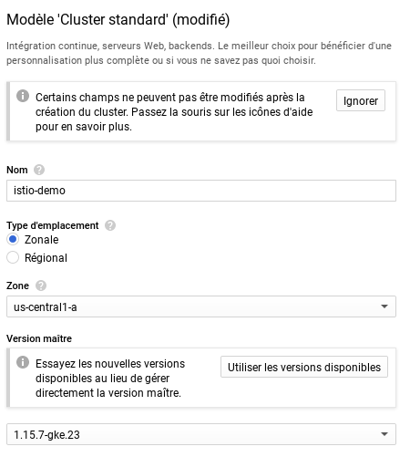

Nom : istio-demo

Version maître (Kubernetes) : 1.15.7-gke.23

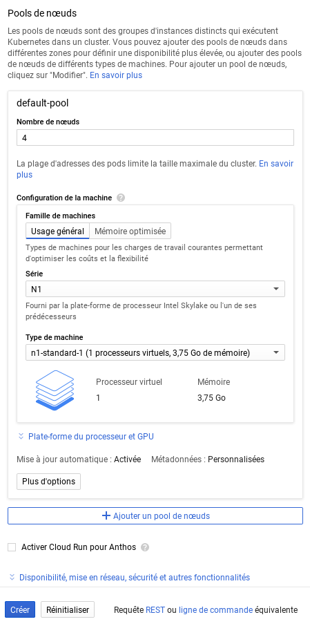

Nombre de nœuds : 4 (nécessaire pour tester toutes les fonctionnalités d'Istio)

Type de machine : n1-standard-1

> Il est possible d'activer Istio à la création du cluster dans l'onglet "Disponibilité, mise en réseau, sécurité et autres fonctionnalités" puis "Activer Istio (bêta)". Pour ce tutoriel nous allons installer Istio à la main pour comprendre son fonctionnement.

Appuyer sur bouton "Créer"

> Le cluster peut mettre plusieurs minutes à se créer


------
<a name="verificationCluster"></a>
### Vérification de l'installation et configuration du cluster Kubernetes

Pour accéder à la console (shell) cliquer sur l'icone en haut à doite 

Vérifier l'état du cluster dans la console
```bash
$ gcloud container clusters list
NAME        LOCATION       MASTER_VERSION  MASTER_IP     MACHINE_TYPE   NODE_VERSION   NUM_NODES  STATUS
istio-demo  us-central1-a  1.15.7-gke.23   35.238.31.56  n1-standard-1  1.15.7-gke.23  4          RUNNING
```

Obtener les informations d'identification de votre cluster afin de pouvoir interagir avec lui avec la commande `kubectl`.
Préciser la zone (LOCATION) de votre cluster, ici `us-central1-a`.
```bash
$ gcloud container clusters get-credentials istio-demo --zone us-central1-a
Fetching cluster endpoint and auth data.
kubeconfig entry generated for istio-demo.
```

Activer l'auto-completion pour la commande `kubectl`
```bash
$ kubectl completion bash > ~/kubectl.bash
```
Sourcer `kubectl.bash` à la fin du fichier `.bashrc` en rajoutant :
```bash
if [ -f "kubectl.bash" ]; then
  source "kubectl.bash"
fi
```

Vérifier la version de Kubernetes
```bash
$ kubectl version
Client Version: version.Info{Major:"1", Minor:"15", GitVersion:"v1.15.9", GitCommit:"2e808b7cb054ee242b68e62455323aa783991f03", GitTreeState:"clean", BuildDate:"2020-01-18T23:33:14Z", GoVersion:"go1.12.12", Compiler:"gc", Platform:"linux/amd64"}
Server Version: version.Info{Major:"1", Minor:"15+", GitVersion:"v1.15.7-gke.23", GitCommit:"06e05fd0390a51ea009245a90363f9161b6f2389", GitTreeState:"clean", BuildDate:"2020-01-17T23:10:45Z", GoVersion:"go1.12.12b4", Compiler:"gc", Platform:"linux/amd64"}
```

Accordez des autorisations d'administrateur de cluster (admin) à l'utilisateur actuel. Pour créer les règles nécessaires pour Istio, l'utilisateur actuel nécessite des autorisations d'administrateur.
```bash
$ kubectl create clusterrolebinding cluster-admin-binding \
    --clusterrole=cluster-admin \
    --user=$(gcloud config get-value core/account)
Your active configuration is: [cloudshell-26194]
clusterrolebinding.rbac.authorization.k8s.io/cluster-admin-binding created
```

------
<a name="installationIstio"></a>
### Installation d'Istio

Télécharger Istio dans le répertoire home du cluster
```bash
$ curl -L https://istio.io/downloadIstio | sh -
```

Ajouter la commande `istioctl` à la variable d'environnement PATH dans le fichier `.bashrc` :
```bash
export PATH="$PATH:$HOME/istio-1.4.5/bin"
```

Activer l'auto-completion pour la commande `istioctl`
```bash
$ cp ~/istio-1.4.5/tools/istioctl.bash ~/.
```
Sourcer `istioctl.bash` à la fin du fichier `.bashrc` en rajoutant :
```bash
if [ -f "istioctl.bash" ]; then
  source "istioctl.bash"
fi
```

Lancer la vérification de pré-installation d'Istio pour savoir si le cluster est prêt à installer Istio
```bash
$ istioctl verify-install
Install Pre-Check passed! The cluster is ready for Istio installation.
```

Plusieurs profils d'installation d'Istio sont disponibles (voir le tableau ci-dessous).
Pour ce tutoriel, nous allons installer le profil "demo" car celui-ci permet de tester toutes les fonctionnalités d'Istio

Services istio-system / profil|default|demo|minimal|sds|remote
---|:---:|:---:|:---:|:---:|:---:
**Composants principaux**|   |   |   |   |   
`istio-citadel`| x | x |   | x | x 
`istio-egressgateway`|   | x |   |   |   
`istio-galley`| x | x |   | x |   
`istio-ingressgateway`| x | x |   | x |   
`istio-nodeagent`|   |   |   | x |   
`istio-pilot`| x | x | x | x |   
`istio-policy`| x | x |   | x |   
`istio-sidecar-injector`| x | x |   | x | x 
`istio-telemetry`| x | x |   | x |   
**Extensions**|   |   |   |   |   
`grafana`|   | x |   |   |   
`istio-tracing`|   | x |   |   |   
`kiali`|   | x |   |   |   
`prometheus`| x | x |   | x |   

Installer le profil "demo"
```bash
$ istioctl manifest apply --set profile=demo
```

Vérifier l'installation en vous assurant que les services Kubernetes suivants sont déployés et vérifiez qu'ils ont tous un CLUSTER-IP approprié, à l'exception du service `jaeger-agent`
```bash
$ kubectl get service -n istio-system
NAME                     TYPE           CLUSTER-IP    EXTERNAL-IP     PORT(S)                                                                                                                      AGE
grafana                  ClusterIP      10.0.12.82    <none>          3000/TCP                                                                                                                     2m9s
istio-citadel            ClusterIP      10.0.12.52    <none>          8060/TCP,15014/TCP                                                                                                           2m11s
istio-egressgateway      ClusterIP      10.0.11.249   <none>          80/TCP,443/TCP,15443/TCP                                                                                                     2m10s
istio-galley             ClusterIP      10.0.15.206   <none>          443/TCP,15014/TCP,9901/TCP,15019/TCP                                                                                         2m11s
istio-ingressgateway     LoadBalancer   10.0.13.178   35.222.49.120   15020:31102/TCP,80:30629/TCP,443:31990/TCP,15029:31705/TCP,15030:32305/TCP,15031:32618/TCP,15032:32128/TCP,15443:31641/TCP   2m10s
istio-pilot              ClusterIP      10.0.3.93     <none>          15010/TCP,15011/TCP,8080/TCP,15014/TCP                                                                                       2m11s
istio-policy             ClusterIP      10.0.0.9      <none>          9091/TCP,15004/TCP,15014/TCP                                                                                                 2m11s
istio-sidecar-injector   ClusterIP      10.0.13.92    <none>          443/TCP                                                                                                                      2m10s
istio-telemetry          ClusterIP      10.0.6.143    <none>          9091/TCP,15004/TCP,15014/TCP,42422/TCP                                                                                       2m6s
jaeger-agent             ClusterIP      None          <none>          5775/UDP,6831/UDP,6832/UDP                                                                                                   2m17s
jaeger-collector         ClusterIP      10.0.9.110    <none>          14267/TCP,14268/TCP,14250/TCP                                                                                                2m17s
jaeger-query             ClusterIP      10.0.12.140   <none>          16686/TCP                                                                                                                    2m16s
kiali                    ClusterIP      10.0.8.83     <none>          20001/TCP                                                                                                                    2m11s
prometheus               ClusterIP      10.0.3.108    <none>          9090/TCP                                                                                                                     2m16s
tracing                  ClusterIP      10.0.1.253    <none>          80/TCP                                                                                                                       2m16s
zipkin                   ClusterIP      10.0.2.15     <none>          9411/TCP                                                                                                                     2m16s
```

Assurez-vous également que les modules Kubernetes correspondants sont déployés et ont un STATUS "Running"
```bash
$ kubectl get pods -n istio-system
NAME                                      READY   STATUS    RESTARTS   AGE
grafana-6c8f45499-wkfjc                   1/1     Running   0          5m31s
istio-citadel-db8578cc4-vn7xt             1/1     Running   0          5m33s
istio-egressgateway-f9c7b6669-pl4xl       1/1     Running   0          5m36s
istio-galley-786ff7f89b-wvqgk             1/1     Running   0          5m33s
istio-ingressgateway-5654f8bf65-fnv2g     1/1     Running   0          5m37s
istio-pilot-c565b478c-vm7gd               1/1     Running   0          5m34s
istio-policy-7d5f97776c-bbxpv             1/1     Running   2          5m33s
istio-sidecar-injector-85577d99c6-glzmd   1/1     Running   0          5m32s
istio-telemetry-55dd49cf85-mzwl8          1/1     Running   3          5m33s
istio-tracing-78548677bc-gcgfk            1/1     Running   0          5m38s
kiali-fb5f485fb-87qhs                     1/1     Running   0          5m32s
prometheus-685585888b-8dhsb               1/1     Running   0          5m37s
```

Lorsque vous déployez votre application à l'aide de `kubectl apply`, l'injecteur sidecar d'Istio injectera automatiquement les conteneurs Envoy (un proxy et un bus de communication conçu pour les grandes architectures modernes orientées services) dans les pods d'applications s'ils sont démarrés dans des namespace étiquetés avec istio-injection=enabled
```bash
$ kubectl label namespace default istio-injection=enabled
namespace/default labeled
```
```bash
$ kubectl get namespace -L istio-injection
NAME              STATUS   AGE    ISTIO-INJECTION
default           Active   127m   enabled
istio-system      Active   32m    disabled
kube-node-lease   Active   127m
kube-public       Active   127m
kube-system       Active   127m
```

------
<a name="installationBookinfo"></a>
### Installation d'une application avec Istio

L'application "bookinfo" déploie un exemple d'application composé de quatre microservices distincts utilisés pour démontrer diverses fonctionnalités d'Istio. L'application affiche des informations sur un livre, semblable à une entrée de catalogue unique d'une librairie en ligne. La page affiche une description du livre, les détails du livre et quelques avis sur le livre.

L'application Bookinfo est divisée en quatre microservices distincts :
* `productpage` : Le microservice de la page produit appelle les détails et examine les microservices pour remplir la page.
* `details` : Le microservice de détails contient des informations sur le livre.
* `reviews` : Le microservice des avis contient des critiques de livres. Il appelle également le microservice `ratings`.
* `ratings` : Le microservice de notation contient des informations sur la notes des livres qui accompagnent une critique de livre.

Il y a 3 versions du microservice `reviews` :
* Version v1 n'appelle pas le service de notation `ratings`.
* Version v2 appelle le service de notation `ratings` et affiche chaque note de 1 à 5 étoiles noires.
* Version v3 appelle le service de notation `ratings` et affiche chaque note de 1 à 5 étoiles rouges.

L'architecture de l'application est présentée ci-dessous.


Déployer l'application bookinfo
```bash
$ kubectl apply -f ~/istio-1.4.5/samples/bookinfo/platform/kube/bookinfo.yaml
service/details created
serviceaccount/bookinfo-details created
deployment.apps/details-v1 created
service/ratings created
serviceaccount/bookinfo-ratings created
deployment.apps/ratings-v1 created
service/reviews created
serviceaccount/bookinfo-reviews created
deployment.apps/reviews-v1 created
deployment.apps/reviews-v2 created
deployment.apps/reviews-v3 created
service/productpage created
serviceaccount/bookinfo-productpage created
deployment.apps/productpage-v1 created
```

Confirmer que tous les services et pods sont correctement définis et fonctionnent
```bash
$ kubectl get services
NAME          TYPE        CLUSTER-IP    EXTERNAL-IP   PORT(S)    AGE
details       ClusterIP   10.0.7.43     <none>        9080/TCP   71s
kubernetes    ClusterIP   10.0.0.1      <none>        443/TCP    4h47m
productpage   ClusterIP   10.0.3.120    <none>        9080/TCP   69s
ratings       ClusterIP   10.0.11.34    <none>        9080/TCP   70s
reviews       ClusterIP   10.0.12.130   <none>        9080/TCP   70s
```
```bash
$ kubectl get pods
NAME                              READY   STATUS    RESTARTS   AGE
details-v1-74f858558f-m4tgw       2/2     Running   0          101s
productpage-v1-8554d58bff-6x8fg   2/2     Running   0          100s
ratings-v1-7855f5bcb9-76426       2/2     Running   0          101s
reviews-v1-59fd8b965b-jmgbs       2/2     Running   0          101s
reviews-v2-d6cfdb7d6-nk2j9        2/2     Running   0          101s
reviews-v3-75699b5cfb-gq8h7       2/2     Running   0          101s
```

> Remarque : chaque pods contient 2 containers, un pour le Envoy sidecar et l'autre le container pour l'application en question

Vérifier maintenant que l'application fonctionne correctement à l'intérieur du cluster en se connectant à l'un des pods du cluster, par exemple `ratings-v1-7855f5bcb9-76426`

```bash
$ kubectl exec -it ratings-v1-7855f5bcb9-76426 bash
root@ratings-v1-7855f5bcb9-76426:/opt/microservices#
```

Récupérer le titre de la page web de l'application avec l'URL http://productpage et le port 9080
```bash
# curl -s http://productpage:9080/productpage | grep "<title>"
    <title>Simple Bookstore App</title>
```
> `Ctrl-D` pour sortir du pod

Pour accéder à l'application à l'extérieur du cluster, vous devez configurer une passerelle (gateway)

```bash
$ kubectl apply -f ~/istio-1.4.5/samples/bookinfo/networking/bookinfo-gateway.yaml
gateway.networking.istio.io/bookinfo-gateway created
virtualservice.networking.istio.io/bookinfo created
```

Vérifier l'installation de la gateway bookinfo
```bash
$ kubectl get gateways
NAME               AGE
bookinfo-gateway   3m30s
```

Récupérer l'adresse IP (EXTERNAL-IP) de la gateway
```bash
$ kubectl get service istio-ingressgateway -n istio-system
NAME                   TYPE           CLUSTER-IP    EXTERNAL-IP     PORT(S)                                                                                                                      AGE
istio-ingressgateway   LoadBalancer   10.0.13.178   35.222.49.120   15020:31102/TCP,80:30629/TCP,443:31990/TCP,15029:31705/TCP,15030:32305/TCP,15031:32618/TCP,15032:32128/TCP,15443:31641/TCP   4h55m
```

Ouvrir un navigateur web et accéder à l'URL avec l'adresse IP : http://35.222.49.120/productpage


Activer les règles de destination pour les différents services 
```bash
$ kubectl apply -f ~/istio-1.4.5/samples/bookinfo/networking/destination-rule-all.yaml
destinationrule.networking.istio.io/productpage created
destinationrule.networking.istio.io/reviews created
destinationrule.networking.istio.io/ratings created
destinationrule.networking.istio.io/details created
```

> Remarque : l'application bookinfo utilise un load balancer pour les 3 microservices `reviews`, il suffit de rafraîchir plusieurs fois la page pour voir que les système de notation diffère d'un microservice à un autre (pas d'étoile, étoiles noires ou étoiles rouges). Cela permet à Istio de rediriger le traffic vers différents microservices selon des règles préétablies. En effet, sans une version de service par défaut explicite vers laquelle acheminer, Istio achemine les demandes vers toutes les versions disponibles (v1, v2 et v3) de manière circulaire. C'est l'une des fonctionnalités principales d'Istio le "**traffic management**" que l'on verra plus loin dans ce tutoriel (https://istio.io/docs/concepts/traffic-management)

------
<a name="trafic"></a>
### Gestion du trafic

<a name="routage"></a>
#### Routage des requêtes

Les services virtuels achemineront tout le trafic vers la v1 du système d'avis `reviews` de chaque microservice. Exécutez la commande suivante pour appliquer les services virtuels.
```bash
$ kubectl apply -f ~/istio-1.4.5/samples/bookinfo/networking/virtual-service-all-v1.yaml
virtualservice.networking.istio.io/productpage created
virtualservice.networking.istio.io/reviews created
virtualservice.networking.istio.io/ratings created
virtualservice.networking.istio.io/details created
```

Sur l'interface Kiali (voir [Visualiser votre maillage](#visualiser)), vous pouvez voir progressivement que les requêtes sont redirigées uniquement sur la v1 de `reviews`.

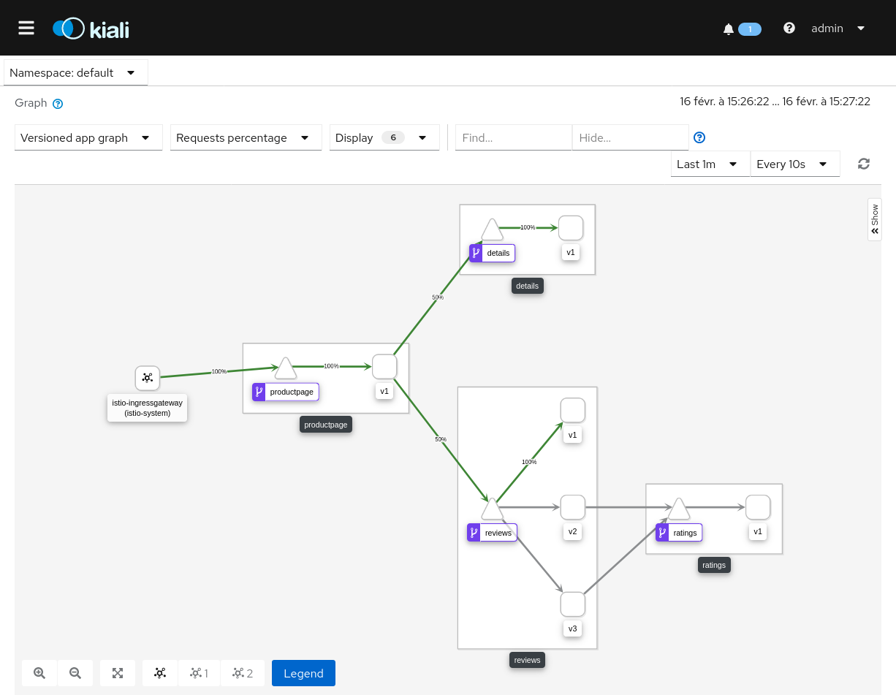

En effet, si on regarde à l'intérieur du fichier `~/istio-1.4.5/samples/bookinfo/networking/virtual-service-all-v1.yaml`, on peut voir que la destination est uniquement la v1 de `reviews`.

```yaml
apiVersion: networking.istio.io/v1alpha3
kind: VirtualService
metadata:
  name: reviews
spec:
  hosts:
  - reviews
  http:
  - route:
    - destination:
        host: reviews
        subset: v1
```

Si l'on consulte le site web (), vous pouvez remarquer que peut importe le nombre de fois que vous rafraîchissez la page, il n'a pas d'étoile dans les avis. Tout le traffic est bien redirigé vers le microservice v1 de `reviews`


Supprimer les services virtuels d'application pour revenir à l'état initial (load balancing entre v1, v2 et v3).

```bash
$ kubectl delete -f ~/istio-1.4.5/samples/bookinfo/networking/virtual-service-all-v1.yaml
virtualservice.networking.istio.io "productpage" deleted
virtualservice.networking.istio.io "reviews" deleted
virtualservice.networking.istio.io "ratings" deleted
virtualservice.networking.istio.io "details" deleted
```

> Remarque : il est aussi possible de filtrer l'accès aux microservices en fonction des informations provenant de l'entête HTTP de l'utilisateur (comme le type de navigateur ou en fonction du nom de l'utilisateur). Pour plus d'information : https://istio.io/docs/tasks/traffic-management/request-routing

------
<a name="fautes"></a>
#### Injection de fautes

Nous allons maintenant volontairement créer une "fault injection" avec la configuration ci-dessous :
* productpage => reviews:v2 => ratings (seulement pour l'utilisateur jason) + HTTP 500
* productpage => reviews:v1 (pour tout le reste)

```bash
$ kubectl apply -f ~/istio-1.4.5/samples/bookinfo/networking/virtual-service-all-v1.yaml
$ kubectl apply -f ~/istio-1.4.5/samples/bookinfo/networking/virtual-service-reviews-test-v2.yaml
$ kubectl apply -f ~/istio-1.4.5/samples/bookinfo/networking/virtual-service-ratings-test-abort.yaml
```

Lorsque l'utilisateur `jason` se connecte à l'application bookinfo, celui-ci obtient une erreur sur les `ratings` "Ratings service is currently unavailable" (erreur HTTP 500). Voici ci-dessous le résultat sur Kiali.

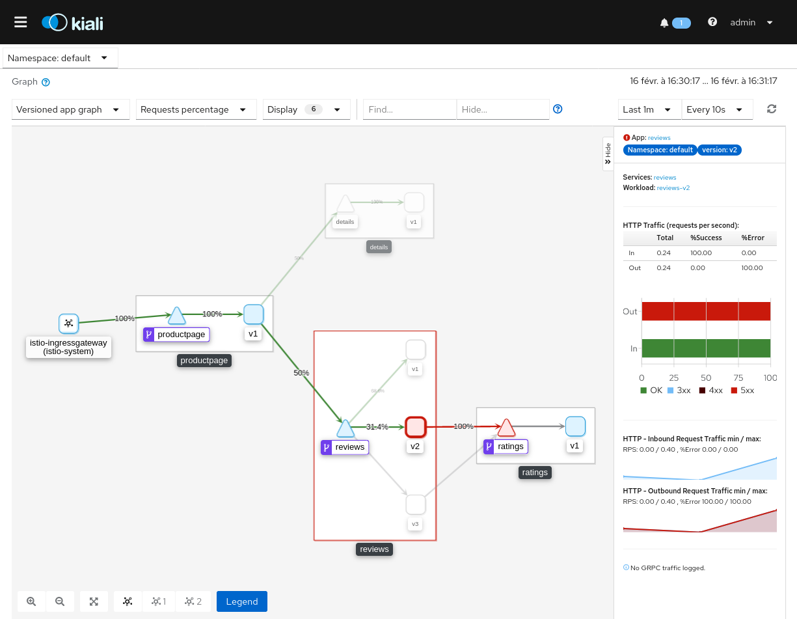

Pour supprimer la configuration et revenir à l'état initial :

```bash
$ kubectl delete -f ~/istio-1.4.5/samples/bookinfo/networking/virtual-service-all-v1.yaml
```

------
<a name="deplacement"></a>
#### Déplacement du trafic

Il est possible de migrer progressivement le trafic (HTTP ou TCP) d'une version d'un microservice à une autre. Cela peut être très utile pour la montée de version d'une application. Plus d'informations : https://istio.io/docs/tasks/traffic-management/traffic-shifting et https://istio.io/docs/tasks/traffic-management/tcp-traffic-shifting

------
<a name="expiration"></a>
#### Délai d'expiration des requêtes

Redirection de tout le traffic vers la version 1 de `reviews`
```bash
$ kubectl apply -f ~/istio-1.4.5/samples/bookinfo/networking/virtual-service-all-v1.yaml
```

Redirection de tout le traffic vers la version 2 de `reviews`
```yaml
$ kubectl apply -f - <<EOF
apiVersion: networking.istio.io/v1alpha3
kind: VirtualService
metadata:
  name: reviews
spec:
  hosts:
    - reviews
  http:
  - route:
    - destination:
        host: reviews
        subset: v2
EOF
```

Ajout d'un délai de 2 secondes
```yaml
$ kubectl apply -f - <<EOF
apiVersion: networking.istio.io/v1alpha3
kind: VirtualService
metadata:
  name: ratings
spec:
  hosts:
  - ratings
  http:
  - fault:
      delay:
        percent: 100
        fixedDelay: 2s
    route:
    - destination:
        host: ratings
        subset: v1
EOF
```

Lorsque vous rafraîchissez la page web de l'application bookinfo, vous pouvez remarquer un délai de 2 secondes et les microservices fonctionnement normalement.
```yaml
$ kubectl apply -f - <<EOF
apiVersion: networking.istio.io/v1alpha3
kind: VirtualService
metadata:
  name: reviews
spec:
  hosts:
  - reviews
  http:
  - route:
    - destination:
        host: reviews
        subset: v2
    timeout: 0.5s
EOF
```

La page web affiche le messagge d'erreur "Error fetching product reviews! Sorry, product reviews are currently unavailable for this book." car le microservice `reviews` renvoie un timeout.


Visualistion sous Kiali, le microservice `reviews` renvoie un timeout après une seconde de délai. Par défaut, l'application bookinfo réssaye une fois la requête en plus de la première d'où la seconde de délai et pas la demie seconde.

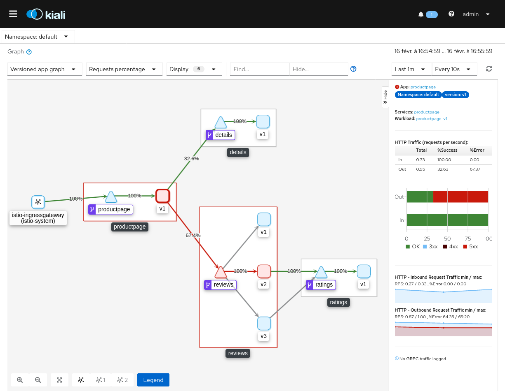

Pour supprimer la configuration et revenir à l'état initial :
```bash
$ kubectl delete -f ~/istio-1.4.5/samples/bookinfo/networking/virtual-service-all-v1.yaml
```

------
<a name="disjoncteur"></a>
#### Disjoncteur

Istio est capable d'implémenter un coupe circuit (circuit breaker). Les disjoncteurs existent pour empêcher les opérations plutôt que de les réexécuter quand le système n'est pas en bonne santé. Plus d'informations : https://istio.io/docs/tasks/traffic-management/circuit-breaking

------
<a name="miroir"></a>
#### Mise en miroir du trafic

La mise en miroir du trafic (traffic mirroring), est un concept qui permet aux équipes d'apporter des modifications à la production avec le moins de risques possible. La mise en miroir envoie une copie du trafic en direct à un service en miroir. Le trafic en miroir se produit en dehors du chemin critique des requêtes pour le service principal. Plus d'information : https://istio.io/docs/tasks/traffic-management/mirroring

<a name="observabilite"></a>
### Observabilité

L'observabilté d'Istio permet de récupérer de la télémétrie prevenant du mesh comme des métriques, des logs, des traces et intègre des outils puissants pour la surveillance du service de maillage (Prometheus, Grafana, Kiali, Fluentd, Jaeger, Zipkin et plein d'autres).

<a name="metriques"></a>
#### Métriques

Cette partie du tutoriel vous présente la configuration, la collecte et le traitement des métriques pour le mesh d'Istio.

##### Prometheus

Enter la commande suivante pour générer des métriques

```bash
$ kubectl apply -f ~/istio-1.4.5/samples/bookinfo/telemetry/metrics.yaml
```

Ce fichier génère des métriques pour tous les services (client et serveur) de l'application bookinfo, configure Prometheus (un système de surveillance de d'alerte https://prometheus.io) pour ajouter les métriques au nom de `double_request_count` et les envoies à Prometheus (voir le fichier `~/istio-1.4.5/samples/bookinfo/telemetry/metrics.yaml` pour plus de détail sur la configuration).

Générer du trafic sur la page `productpage`

> Rappel : l'adresse ip externe est celle de l'ingressgateway (LoadBalancer)
```bash
$ watch curl -s -o /dev/null http://35.222.49.120/productpage 
```

Lancer prometheus dans un nouvel onglet de la console shell
```bash
$ istioctl dashboard prometheus
```

Dans Prometheus, cliquez dans l'onglet `Graph` puis chercher dans la liste `istio_double_request_count`, cliquer sur le bouton `Execute` et enfin changer de mode (Console à Graph) comme sur l'image ci-dessous :

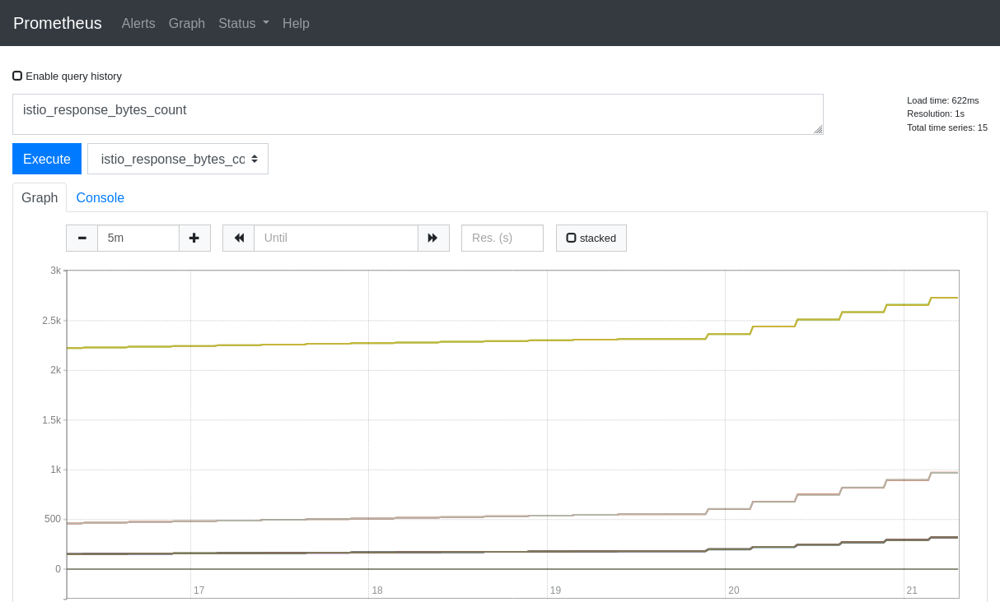

Vous pouvez voir toutes les métriques de bookinfo arriver toutes les 2 secondes (grâce aux programme `watch`) dans Prometheus.

> `Ctrl-C` pour terminer Prometheus.

Pour revenir à l'état initial :

```bash
$ kubectl delete -f ~/istio-1.4.5/samples/bookinfo/telemetry/metrics.yaml
```

> Remarque : il est aussi possible de générer des métriques pour des services en TCP. Plus d'informations : https://istio.io/docs/tasks/observability/metrics/tcp-metrics

##### Grafana

Envoyer périodiquement (0.5 requête par seconde) des requêtes sur la page web vers le cluster
```bash
$ watch curl -s -o /dev/null http://35.222.49.120/productpage
```

Vous pouvez utiliser Grafana (https://grafana.com), une solution d'analyse et de surveillance.

Lancer Grafana dans un nouvel onglet de la console shell

```bash
$ istioctl dashboard grafana
http://localhost:40939
```

Pour tester son fonctionnement sur le cluster en cliquant sur le lien dans un navigateur et aller sur le dashboard "Istio Workload Dashboard" (onglet "Home" puis "Istio"), changer le namespace (default) et le workload (productpage-v1). Ce dashboad surveille les activités du cluster notament l'application bookinfo (http://35.222.49.120/productpage).

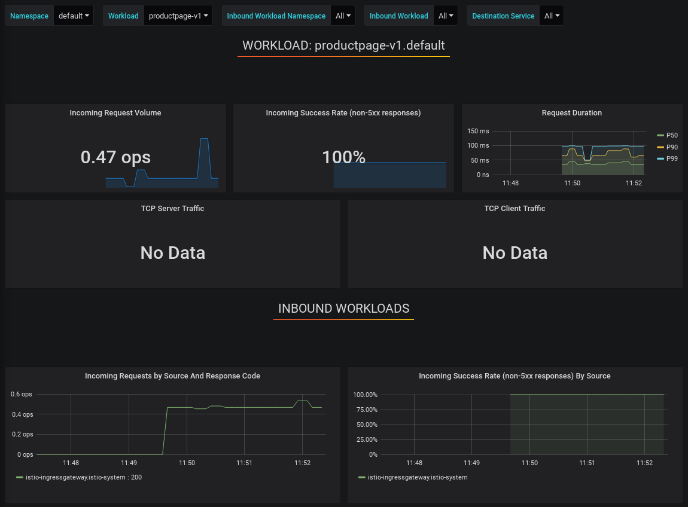

> `Ctrl-C` pour terminer Grafana.

-----
<a name="journaux"></a>
#### Journaux

##### Collecte de logs

Appliquez un fichier YAML avec une configuration pour le nouveau flux (`newlog`) de logs qu'Istio générera et collectera automatiquement. 
```bash
$ kubectl apply -f ~/istio-1.4.5/samples/bookinfo/telemetry/log-entry.yaml
```

Générer du trafic sur la page `productpage`
```bash
$ watch curl -s -o /dev/null http://35.222.49.120/productpage 
```

Vérifiez que le flux de logs qui ont le nom `newlog`
```bash
$ kubectl logs -n istio-system -l istio-mixer-type=telemetry -c mixer | grep "newlog" | grep -v '"destination":"telemetry"' | grep -v '"destination":"pilot"' | grep -v '"destination":"policy"' | grep -v '"destination":"unknown"'

{"level":"warn","time":"2020-02-18T03:30:11.834802Z","instance":"newlog.instance.istio-system","destination":"ratings","latency":"4.287619ms","responseCode":200,"responseSize":48,"source":"reviews","user":"unknown"}
{"level":"warn","time":"2020-02-18T03:30:11.823123Z","instance":"newlog.instance.istio-system","destination":"reviews","latency":"22.106012ms","responseCode":200,"responseSize":379,"source":"productpage","user":"unknown"}
{"level":"warn","time":"2020-02-18T03:30:11.821969Z","instance":"newlog.instance.istio-system","destination":"reviews","latency":"24.682795ms","responseCode":200,"responseSize":379,"source":"productpage","user":"unknown"}
{"level":"warn","time":"2020-02-18T03:30:11.810979Z","instance":"newlog.instance.istio-system","destination":"productpage","latency":"38.641273ms","responseCode":200,"responseSize":5183,"source":"istio-ingressgateway","user":"unknown"}
{"level":"warn","time":"2020-02-18T03:30:11.810499Z","instance":"newlog.instance.istio-system","destination":"productpage","latency":"40.103621ms","responseCode":200,"responseSize":5183,"source":"istio-ingressgateway","user":"unknown"}
```

Pour revenir à la configuration initiale
```bash
$ kubectl delete -f ~/istio-1.4.5/samples/bookinfo/telemetry/log-entry.yaml
```
> Remarque : on peut aussi collecter les logs d'accès de Envoy proxy. Plus d'informations : https://istio.io/docs/tasks/observability/logs/access-log

##### Fluentd, Elasticsearch et Kibana

Istio est capable de configurer des entrées de logs personnalisées et de les envoyer dans Fluentd (collecteur de log, https://www.fluentd.org).

Fluent peut être combiné avec Elasticsearch (moteur de recherche et d'analyse distribué, https://www.elastic.co/elasticsearch) et Kibana (visualisation des données pour les données indexées dans Elasticsearch, https://www.elastic.co/kibana).

Sauvegarder la configuration ci-dessous pour installer Fluent, Elasticsearch et Kibana dans un fichier `logging-stack.yaml`
```yaml
# Logging Namespace. All below are a part of this namespace.
apiVersion: v1
kind: Namespace
metadata:
  name: logging
---
# Elasticsearch Service
apiVersion: v1
kind: Service
metadata:
  name: elasticsearch
  namespace: logging
  labels:
    app: elasticsearch
spec:
  ports:
  - port: 9200
    protocol: TCP
    targetPort: db
  selector:
    app: elasticsearch
---
# Elasticsearch Deployment
apiVersion: apps/v1
kind: Deployment
metadata:
  name: elasticsearch
  namespace: logging
  labels:
    app: elasticsearch
spec:
  replicas: 1
  selector:
    matchLabels:
      app: elasticsearch
  template:
    metadata:
      labels:
        app: elasticsearch
      annotations:
        sidecar.istio.io/inject: "false"
    spec:
      containers:
      - image: docker.elastic.co/elasticsearch/elasticsearch-oss:6.1.1
        name: elasticsearch
        resources:
          # need more cpu upon initialization, therefore burstable class
          limits:
            cpu: 1000m
          requests:
            cpu: 100m
        env:
          - name: discovery.type
            value: single-node
        ports:
        - containerPort: 9200
          name: db
          protocol: TCP
        - containerPort: 9300
          name: transport
          protocol: TCP
        volumeMounts:
        - name: elasticsearch
          mountPath: /data
      volumes:
      - name: elasticsearch
        emptyDir: {}
---
# Fluentd Service
apiVersion: v1
kind: Service
metadata:
  name: fluentd-es
  namespace: logging
  labels:
    app: fluentd-es
spec:
  ports:
  - name: fluentd-tcp
    port: 24224
    protocol: TCP
    targetPort: 24224
  - name: fluentd-udp
    port: 24224
    protocol: UDP
    targetPort: 24224
  selector:
    app: fluentd-es
---
# Fluentd Deployment
apiVersion: apps/v1
kind: Deployment
metadata:
  name: fluentd-es
  namespace: logging
  labels:
    app: fluentd-es
spec:
  replicas: 1
  selector:
    matchLabels:
      app: fluentd-es
  template:
    metadata:
      labels:
        app: fluentd-es
      annotations:
        sidecar.istio.io/inject: "false"
    spec:
      containers:
      - name: fluentd-es
        image: gcr.io/google-containers/fluentd-elasticsearch:v2.0.1
        env:
        - name: FLUENTD_ARGS
          value: --no-supervisor -q
        resources:
          limits:
            memory: 500Mi
          requests:
            cpu: 100m
            memory: 200Mi
        volumeMounts:
        - name: config-volume
          mountPath: /etc/fluent/config.d
      terminationGracePeriodSeconds: 30
      volumes:
      - name: config-volume
        configMap:
          name: fluentd-es-config
---
# Fluentd ConfigMap, contains config files.
kind: ConfigMap
apiVersion: v1
data:
  forward.input.conf: |-
    # Takes the messages sent over TCP
    <source>
      type forward
    </source>
  output.conf: |-
    <match **>
       type elasticsearch
       log_level info
       include_tag_key true
       host elasticsearch
       port 9200
       logstash_format true
       # Set the chunk limits.
       buffer_chunk_limit 2M
       buffer_queue_limit 8
       flush_interval 5s
       # Never wait longer than 5 minutes between retries.
       max_retry_wait 30
       # Disable the limit on the number of retries (retry forever).
       disable_retry_limit
       # Use multiple threads for processing.
       num_threads 2
    </match>
metadata:
  name: fluentd-es-config
  namespace: logging
---
# Kibana Service
apiVersion: v1
kind: Service
metadata:
  name: kibana
  namespace: logging
  labels:
    app: kibana
spec:
  ports:
  - port: 5601
    protocol: TCP
    targetPort: ui
  selector:
    app: kibana
---
# Kibana Deployment
apiVersion: apps/v1
kind: Deployment
metadata:
  name: kibana
  namespace: logging
  labels:
    app: kibana
spec:
  replicas: 1
  selector:
    matchLabels:
      app: kibana
  template:
    metadata:
      labels:
        app: kibana
      annotations:
        sidecar.istio.io/inject: "false"
    spec:
      containers:
      - name: kibana
        image: docker.elastic.co/kibana/kibana-oss:6.1.1
        resources:
          # need more cpu upon initialization, therefore burstable class
          limits:
            cpu: 1000m
          requests:
            cpu: 100m
        env:
          - name: ELASTICSEARCH_URL
            value: http://elasticsearch:9200
        ports:
        - containerPort: 5601
          name: ui
          protocol: TCP
---
```

Lancer la configuration sauvegardée
```bash
$ kubectl apply -f logging-stack.yaml
```

Configurer Istio pour envoyer des logs dans Fluentd
```bash
$ kubectl apply -f ~/istio-1.4.5/samples/bookinfo/telemetry/fluentd-istio.yaml
```

Générer du trafic sur la page `productpage`
```bash
$ watch curl -s -o /dev/null http://35.222.49.120/productpage 
```

Vous pouvez désormais accéder à Kibana avec une redirection de port ou en exposant le service (`127.0.0.1:5601`)

```bash
$ kubectl -n logging port-forward service/kibana 5061:5601
```

> Ctrl-C pour quitter la redirection de port

-----
<a name="tracage"></a>
#### Traçage distribué

Le suivi distribué permet aux utilisateurs de suivre une demande à travers le mesh qui est distribué sur plusieurs services. Cela permet une compréhension plus approfondie de la latence des demandes, de la sérialisation et du parallélisme via la visualisation.

Istio utilise les fonctionnalités de trace du proxy Envoy pour les traces et permet d'installer et d'utiliser des outils de consultation de trace comme Zipkin, Jaeger et LightStep.

Dans ce tutoriel, seul Jaeger sera présenté car les deux autres offrent les mêmes fonctionnalités de visualisation de traces.

##### Jaeger

Pour démarrer Jaeger
```bash
$ istioctl dashboard jaeger
```

Générer du trafic sur la page `productpage`
```bash
$ watch curl -s -o /dev/null http://35.222.49.120/productpage 
```

Sélectionner sur le panneau de gauche le service `productpage.default` puis `Find Traces` pour chercher les 20 dernières traces de la page `productpage`.

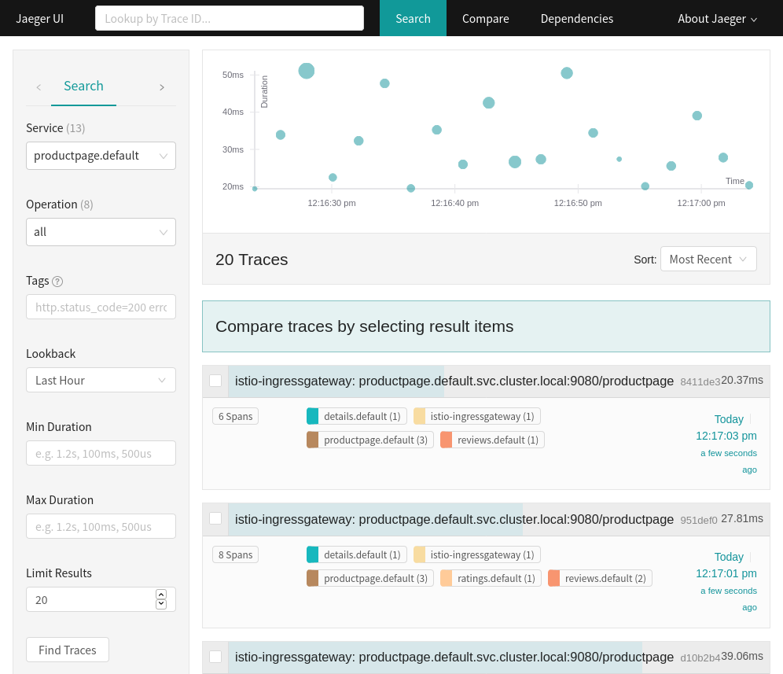

Cliquer sur la dernière trace pour voir plus de détail comme les différentes plages qui correspondent aux demandes des services de bookinfo
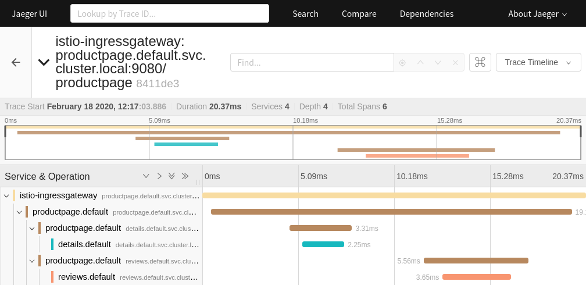

-----
<a name="visualiser"></a>
#### Visualiser votre maillage

Pour visualiser le service mesh Istio, vous pouvez utiliser Kiali (installé de base avec grafana dans le profil demo). Kiali (https://kiali.io/) est un outil de visualisation de l'observabilité du maillage de service et configuration pour Istio. L'onglet "Graph" permet de visualiser en temps réel l'état du maillage de service et le traffic pour chaque microservices.

Lancer kiali dans un nouvel onglet de la console shell
```bash
$ istioctl dashboard kiali
http://localhost:45465/kiali
```

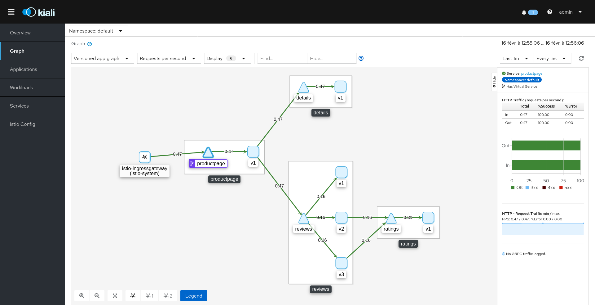

> `Ctrl-C` pour terminer kiali.

<a name="securite"></a>
### Securité

Les fonctionnalités de sécurité d'Istio offrent une identité forte, une politique puissante, un cryptage TLS transparent et des outils d'authentification, d'autorisation et d'audit (AAA) pour protéger les services et les données. Les objectifs de la sécurité d'Istio sont :
* Sécurité par défaut : aucune modification nécessaire pour le code d'application et l'infrastructure
* Défense en profondeur : intégrez les systèmes de sécurité existants pour fournir plusieurs couches de défense
* Réseau sans confiance : créez des solutions de sécurité sur des réseaux non fiables


La sécurité dans Istio implique plusieurs composants :

* `Citadel` pour la gestion des clés et des certificats
* `Sidecar` et les `proxies` (Ingress et Egress) pour implémenter une communication et une autorisation sécurisées entre les clients et les serveurs
* `Pilot` pour distribuer les politiques d'authentification et sécuriser les informations de nommage aux mandataires
* `Mixer` pour gérer l'audit

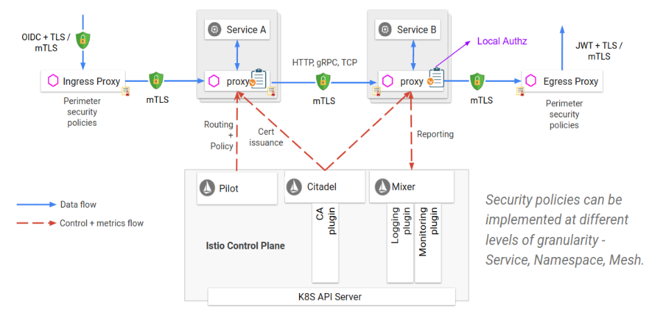

<a name="mtls"></a>

#### Authentification avec TLS mutuelle (mTLS)
Vous pouvez appliquer une politique de sécurité à des services spécifiques ou vous pouvez l'appliquer à une étendue plus large, par exemple, à tous les services dans un namespace ou au mesh complet.
mTLS possède deux modes : `PERMISSIVE` ou `STRICT`.
Le mode `PERMISSIVE` permet le trafic en clair ou encrypté tandis que le mode `STRICT` autorise seulement le trafic encrypté. `PERMISSIVE` est le mode par défaut dans le profil "demo" de Istio.

Service-specific policy
```yaml
apiVersion: "authentication.istio.io/v1alpha1"
kind: "Policy"
metadata:
  name: "bar-policy"
spec:
   targets:
   - name: bar
   peers:
   - mtls: {}
```

Namespace-scoped policy
```yaml
apiVersion: "authentication.istio.io/v1alpha1"
kind: "Policy"
metadata:
  name: "default"
  namespace: "ns1"
spec:
   peers:
   - mtls: {}
```

Mesh-scoped policy
```yaml
apiVersion: "authentication.istio.io/v1alpha1"
kind: "MeshPolicy"
metadata:
  name: default
spec:
   peers:
   - mtls: {}
```

Nous allons activer mTLS de manière globale (mesh complet).
L'exemple qui suit utilise deux namespace foo et bar, avec deux services, httpbin et sleep, fonctionnant tous les deux avec un proxy Envoy sidecar. Nous utilisons également des secondes instances de httpbin et nous mettons en veille sans le sidecar dans le namespace hérité.
```bash
$ kubectl create namespace foo
$ kubectl apply -f <(istioctl kube-inject -f ~/istio-1.4.5/samples/httpbin/httpbin.yaml) -n foo
$ kubectl apply -f <(istioctl kube-inject -f ~/istio-1.4.5/samples/sleep/sleep.yaml) -n foo
$ kubectl create namespace bar
$ kubectl apply -f <(istioctl kube-inject -f ~/istio-1.4.5/samples/httpbin/httpbin.yaml) -n bar
$ kubectl apply -f <(istioctl kube-inject -f ~/istio-1.4.5/samples/sleep/sleep.yaml) -n bar
$ kubectl create namespace legacy
$ kubectl apply -f ~/istio-1.4.5/samples/httpbin/httpbin.yaml -n legacy
$ kubectl apply -f ~/istio-1.4.5/samples/sleep/sleep.yaml -n legacy
```

Cette commande permet en une seule ligne d'itérer de manière pratique dans toutes les combinaisons d'accessibilité :
```bash
$ for from in "foo" "bar" "legacy"; do for to in "foo" "bar" "legacy"; do kubectl exec $(kubectl get pod -l app=sleep -n ${from} -o jsonpath={.items..metadata.name}) -c sleep -n ${from} -- curl "http://httpbin.${to}:8000/ip" -s -o /dev/null -w "sleep.${from} to httpbin.${to}: %{http_code}\n"; done; done

sleep.foo to httpbin.foo: 200
sleep.foo to httpbin.bar: 200
sleep.foo to httpbin.legacy: 200
sleep.bar to httpbin.foo: 200
sleep.bar to httpbin.bar: 200
sleep.bar to httpbin.legacy: 200
sleep.legacy to httpbin.foo: 200
sleep.legacy to httpbin.bar: 200
sleep.legacy to httpbin.legacy: 200
```

Stratégie d'authentification au mesh complet `MeshPolicy` qui active TLS mutuel :
```yaml
$ kubectl apply -f - <<EOF
apiVersion: "authentication.istio.io/v1alpha1"
kind: "MeshPolicy"
metadata:
  name: "default"
spec:
  peers:
  - mtls: {}
EOF
```

Pour l'instant, seul le côté récepteur est configuré pour utiliser le mTLS. Si vous exécutez la commande curl entre les services Istio (c'est-à-dire ceux avec sidecars), toutes les demandes échoueront avec un code d'erreur 503 car le côté client utilise toujours du texte brut.
```bash
$ for from in "foo" "bar"; do for to in "foo" "bar"; do kubectl exec $(kubectl get pod -l app=sleep -n ${from} -o jsonpath={.items..metadata.name}) -c sleep -n ${from} -- curl "http://httpbin.${to}:8000/ip" -s -o /dev/null -w "sleep.${from} to httpbin.${to}: %{http_code}\n"; done; done

sleep.foo to httpbin.foo: 503
sleep.foo to httpbin.bar: 503
sleep.bar to httpbin.foo: 503
sleep.bar to httpbin.bar: 503
```

Pour configurer le côté client, vous devez définir des règles de destination `DestinationRule` pour utiliser mTLS.
```yaml
$ kubectl apply -f - <<EOF
apiVersion: "networking.istio.io/v1alpha3"
kind: "DestinationRule"
metadata:
  name: "default"
  namespace: "istio-system"
spec:
  host: "*.local"
  trafficPolicy:
    tls:
      mode: ISTIO_MUTUAL
EOF
```

En réexécutant la commande comme ci-dessus, vous verrez que toutes les demandes entre Istio-services sont maintenant terminées avec succès (code 200)
```bash
$ for from in "foo" "bar"; do for to in "foo" "bar"; do kubectl exec $(kubectl get pod -l app=sleep -n ${from} -o jsonpath={.items..metadata.name}) -c sleep -n ${from} -- curl "http://httpbin.${to}:8000/ip" -s -o /dev/null -w "sleep.${from} to httpbin.${to}: %{http_code}\n"; done; done

sleep.foo to httpbin.foo: 200
sleep.foo to httpbin.bar: 200
sleep.bar to httpbin.foo: 200
sleep.bar to httpbin.bar: 200
```

Pour supprimer la configuration et revenir à l'état initial :
```bash
$ kubectl delete meshpolicy default
$ kubectl delete destinationrules default -n istio-system
$ kubectl delete nanespace foo bar legacy
```

-----
<a name="citadel"></a>
#### Configuration Citadel

Il est possible de configurer Citadel des certificats provenant d'autorités de certifications externes.

Par défaut, Citadel génère un certificat racine et une clé auto-signés et les utilise pour signer les certificats de `workload`. Citadel peut également utiliser le certificat et la clé spécifiés par l'opérateur pour signer les certificats de `workload`, avec le certificat racine spécifié par l'opérateur. Plus d'informations : https://istio.io/docs/tasks/security/citadel-config/plugin-ca-cert

Vous pouvez activer la fonction de vérification de l'intégrité de Citadel pour détecter les échecs du service Citadel CSR (Certificate Signing Request). Lorsqu'une défaillance est détectée, Kubelet redémarre automatiquement le conteneur Citadel. Plus d'information : https://istio.io/docs/tasks/security/citadel-config/health-check

-----
<a name="autorisation"></a>
#### Autorisation

Il est possible de mettre en place des contrôles d'accès avec Istio. La première étape est d'appliquer une politique `deny-all` qui aura pour conséquence de rejeter toutes les requêtes. Il faudra ensuite accorder plus d'accès graduellement.

Voici un exemple de configuration pour appliquer la politique `deny-all` sur le namespace `default`
```yaml
$ kubectl apply -f - <<EOF
apiVersion: security.istio.io/v1beta1
kind: AuthorizationPolicy
metadata:
  name: deny-all
  namespace: default
spec:
  {}
EOF
```

En rafraîchissant la page `productpage` de l'application bookinfo (http://35.222.49.120/productpage) dans un navigateur, vous obtienderez après quelques secondes le message : `RBAC: access denied`.

Exécutez la commande suivante pour créer une politique `productpage-viewer` pour autoriser l'accès avec la méthode GET à la page `productpage`.
```yaml
$ kubectl apply -f - <<EOF
apiVersion: "security.istio.io/v1beta1"
kind: "AuthorizationPolicy"
metadata:
  name: "productpage-viewer"
  namespace: default
spec:
  selector:
    matchLabels:
      app: productpage
  rules:
  - to:
    - operation:
        methods: ["GET"]
EOF
```

La page web s'affiche désormais mais les microservices `details` et `reviews` ne sont pas accessible car nous n'avons pas autorisé `productpage` à accéder à `details` et `reviews`. 

Exécutez les deux commandes suivantes pour créer les politiques `details-viewer` et `reviews-views` afin d'autoriser la charge de travail de `productpage`, qui émet des demandes à l'aide du compte de service `cluster.local/ns/default/sa/bookinfo-productpage`, d'accéder à la charge de travail `details` via les méthodes GET :
```yaml
$ kubectl apply -f - <<EOF
apiVersion: "security.istio.io/v1beta1"
kind: "AuthorizationPolicy"
metadata:
  name: "details-viewer"
  namespace: default
spec:
  selector:
    matchLabels:
      app: details
  rules:
  - from:
    - source:
        principals: ["cluster.local/ns/default/sa/bookinfo-productpage"]
    to:
    - operation:
        methods: ["GET"]
EOF
```
```yaml
$ kubectl apply -f - <<EOF
apiVersion: "security.istio.io/v1beta1"
kind: "AuthorizationPolicy"
metadata:
  name: "reviews-viewer"
  namespace: default
spec:
  selector:
    matchLabels:
      app: reviews
  rules:
  - from:
    - source:
        principals: ["cluster.local/ns/default/sa/bookinfo-productpage"]
    to:
    - operation:
        methods: ["GET"]
EOF
```

La page affiche affiche maintenant les détails (partie gauche) et les avis (partie droite). Cependant, il y a une erreur `Ratings service currently unavailable` pour la partie des notations. Ce comportement est normal car la charge de travail `reviews` n'a pas la permission d'accéder à `ratings`.

Exécutez la commande suivante pour créer la politique `ratings-viewer` afin d'autoriser la charge de travail de `reviews`, qui émet des demandes à l'aide du compte de service `cluster.local/ns/default/sa/bookinfo-reviews`, d'accéder à la charge de travail `ratings` via les méthodes GET :
```yaml
$ kubectl apply -f - <<EOF
apiVersion: "security.istio.io/v1beta1"
kind: "AuthorizationPolicy"
metadata:
  name: "ratings-viewer"
  namespace: default
spec:
  selector:
    matchLabels:
      app: ratings
  rules:
  - from:
    - source:
        principals: ["cluster.local/ns/default/sa/bookinfo-reviews"]
    to:
    - operation:
        methods: ["GET"]
EOF
```

La page web est désormais accessible dans son intégralité avec le système de notation (pas d'étoile, étoiles noires ou étoile rouges).

Pour revenir à la configuration initiale :
```bash
$ kubectl delete authorizationpolicy.security.istio.io/deny-all
$ kubectl delete authorizationpolicy.security.istio.io/productpage-viewer
$ kubectl delete authorizationpolicy.security.istio.io/details-viewer
$ kubectl delete authorizationpolicy.security.istio.io/reviews-viewer
$ kubectl delete authorizationpolicy.security.istio.io/ratings-viewer
```

Il est aussi possible de limiter les accès pour le trafic TCP, pour les groupes, les listes et plus. Plus d'informations : https://istio.io/docs/tasks/security/authorization

<a name="politiques"></a>
### Politiques

<a name="activationPolitiques"></a>
#### Activation de l'application de la politique

Par défaut, lors de l’installation du profil "demo" les politiques (policies) sont activées, vous pouvez le vérifier avec la commande suivante

```bash
$ kubectl -n istio-system get cm istio -o jsonpath="{@.data.mesh}" | grep disablePolicyChecks
disablePolicyChecks: false
```

Pour activer les politiques

```bash
$ istioctl manifest apply --set values.global.disablePolicyChecks=false
```

-----
<a name="limite"></a>
#### Activation de la limite de trafic

Avec Istio, vous pouvez limiter dynamiquement le trafic vers un service. Vous aller appliquer des politiques permettant de limiter l'accès à l'application bookinfo grâce à des quotas.

Mise à jour la route pour utiliser uniquement le microservice `reviews-v1`
```bash
$ kubectl apply -f ~/istio-1.4.5/samples/bookinfo/networking/virtual-service-all-v1.yaml
```

La commande ci-dessous permet d'appliquer 4 règles différentes :
* 500 requêtes par seconde si aucune autre règles n'est applicable
* 1 requête toutes les 5 secondes si la destination est `reviews`
* 500 requêtes par seconde si la destination est `productpage` et la source `10.28.11.20`
* 2 requêtes toutes les 5 secondes si la destination est `productpage`
```bash
$ kubectl apply -f ~/istio-1.4.5/samples/bookinfo/policy/mixer-rule-productpage-ratelimit.yaml
```

Lorsque vous rafraîchissez la page `productpage` dans votre navigateur (exemple http://35.222.49.120/productpage) la règle 4 s'applique, elle vous autorise donc 2 requêtes toutes les 5 secondes sur la page `productpage`.
Vous verrez donc le message d'erreur suivant dans votre navigateur lorsque le quota est dépassé : `RESOURCE_EXHAUSTED:Quota is exhausted for: requestcountquota`

Pour revenir à l'état initial :
```bash
$ kubectl delete -f ~/istio-1.4.5/samples/bookinfo/policy/mixer-rule-productpage-ratelimit.yaml
$ kubectl delete -f ~/istio-1.4.5/samples/bookinfo/networking/virtual-service-all-v1.yaml
```

-----
<a name="en-tete"></a>
#### Contrôler les en-têtes et le routage

Il est possible d'utiliser un adaptateur de politiques pour manipuler les en-têtes des requêtes HTTP et de routage. Plus d'informations : https://istio.io/docs/tasks/policy-enforcement/control-headers

-----
<a name="liste"></a>
#### Refus et liste blanche/noire

Istio peut contrôler l'accès à un service à l'aide de simples refus, d'une liste blanche ou noire basée sur des attributs ou d'une liste blanche ou noire basée sur IP. Plus d'informations : https://istio.io/docs/tasks/policy-enforcement/denial-and-list

<a name="references"></a>

## 4) Références

* Istio on GKE. 18 février 2020. https://cloud.google.com/istio/docs/istio-on-gke/overview [consulté le 1 février 2020]
* Installing Istio on GKE. 19 février 2020. https://cloud.google.com/istio/docs/istio-on-gke/installing [consulté le 1 février 2020]
* istio/istio: Connect, secure, control, and observe services. 19 février 2020. https://github.com/istio/istio [consulté le 13 février 2020]
* Istio / Docs. 15 octobre 2019. https://istio.io/docs [consulté le 29 janvier 2020]
* [ Kube 50 ] Installing Istio in Kubernetes Cluster - YouTube. 15 août 2019. https://www.youtube.com/watch?v=WFu8OLXUETY&list=PL34sAs7_26wPkw9g-5NQPP_rHVzApGpKP [consulté le 14 février 2020]
* What is Istio Service Mesh? - YouTube. 4 novembre 2019. https://www.youtube.com/watch?v=z6WjVJ1XelY [consulté le 17 février 2020]
* kubectl Cheat Sheet - Kubernetes. 9 février 2020. https://kubernetes.io/docs/reference/kubectl/cheatsheet [consulté le 13 février 2020]
* Learn Kubernetes Basics - Kubernetes. 26 octobre 2019. https://kubernetes.io/docs/tutorials/kubernetes-basics [consulté le 29 janvier 2020]
* What is Envoy — envoy 1.14.0-dev-29f6b9 documentation. 15 février 2020. https://www.envoyproxy.io/docs/envoy/latest/intro/what_is_envoy [consulté le 15 février 2020]
* Qu'est-ce qu'un Service Mesh ?. 18 février 2020. https://www.redhat.com/fr/topics/microservices/what-is-a-service-mesh [consulté le 18 février 2020]