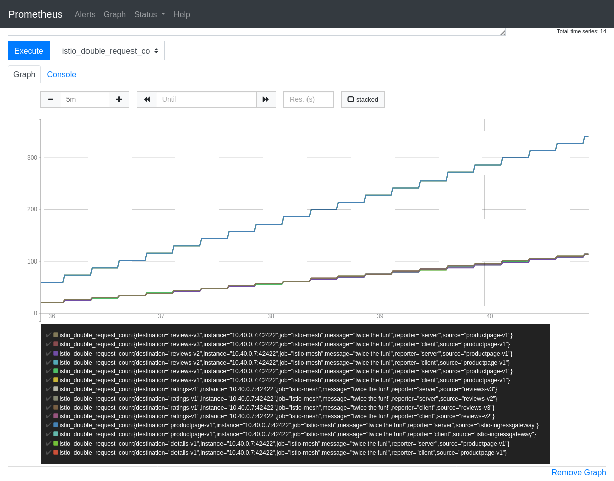

# Service mesh with Istio : Tutoriel

## Sommaire test2

1. [Présentation de la technologie](#presentation)
2. [Objectifs du tutoriel - contexte, description et résultats/connaisses attendus après l’exécution](#objectifs)
3. [Description en détail de tous les configurations et pas à suivre](#tutoriel)
    1. [Configuration Google Cloud GKE (Google Kubernetes Engine)](#GKE)
    2. [Créer un nouveau cluster Kubernetes](#createCluster)
    3. [Vérification de l'installation et configuration du cluster Kubernetes](#verificationCluster)
    4. [Installation d'Istio](#installationIstio)
    5. [Installation d'une application avec Istio](#installationBookinfo)
    6. [Traffic management](#traffic)
        1. [Request routing](#routing)
        2. [Fault injection](#fault)
        3. [Traffic shifting](#shifting)
        4. [Request timeouts](#timeout)
        5. [Circuit breaker](#breaker)
        6. [Mirroring](#mirroring)
    7. [Observability](#observability)
        1. [Metrics](#metrics)
        2. [Logs](#logs)
        3. [Distributed tracing](#tracing)
        4. [Visualizing your mesh](#visualizing)
    8. [Security](#security)
        1. [Authentication with mutual TLS (mTLS)](#mtls)
        2. [Citadel configuration](#citadel)
        3. [Authorization](#authorization)
    9. [Policies](#policies)
        1. [Enabling policy enforcement](#enablePolicy)
        2. [Enabling rate limit](#rateLimit)
        3. [Control headers and routing](#headers)
        4. [Denials and white/black listing](#listing)
4. [Les code source et scripts élabore](#code)
5. [Diapos de votre présentation en PDF](#diapo)

<a name="presentation"></a>

## 1) Présentation de la technologie

**Service mesh** = Network of microservices

**Istio** = Complete solution to manage a service mesh

**Core features of Istio** = Traffic management, Security, Policies, Observability

**Features Istio** = Load balancing, secure service-to-service authentication, monitoring, traffic control, policy layer, automatic metrics/logs

**Sidecar proxy** = network communication between microservices

**Ingress gateway** = make the application accessible from outside of the Kubernetes cluster

**Platform support** = Spanning Cloud, on-premise, Kubernetes, Mesos, and more

<a name="objectifs"></a>
## 2) Objectifs du tutoriel - contexte, description et résultats/connaisses  attendus après  l’exécution

L'objectif de ce tutoriel est de comprendre le contexte du maillage de service (service mesh) en particulier Istio (https://istio.io). Pour cela vous allez installer Istio dans un cluster Kubernetes (https://kubernetes.io) sur le cloud de Google avec GKE (Google Kubernetes Engine). Ce tutoriel vous montrera aussi les principales fonctionnalités d'Istio sous la forme d'exemples facile à comprendre.

Après ce tutoriel vous serez capable de déployer une application sur Kubernetes avec Istio et d'activer certaines fonctionnalités clés d'Istio comme la gestion du trafic, la sécurité, des politiques et de l'observabilité.

Pour ce tutoriel il est recommandé d'avoir des connaissances de Linux (Debian) et de connaître les grands principes de la conteneurisation (Docker et Kubernetes).

Au cours de ce tutoriel vous installerez :

**Google Cloud** = n1-standard-1 (4 nœuds/machines)

**Cluster Kubernetes** = 1.15.7-gke.23

**Istio** = 1.4.4

<a name="tutoriel"></a>
## 3) Description en détail de tous les configurations  et pas à suivre

<a name="GKE"></a>
### Configuration Google Cloud GKE (Google Kubernetes Engine)

Créer un compte Google : https://accounts.google.com/signup

Connecter vous sur le cloud de Google : https://console.cloud.google.com

Activer votre compte cloud gratuitement (300$ de crédits offert ou pendant 1 an)

Créer un nouveau projet

------
<a name="createCluster"></a>
### Créer un nouveau cluster Kubernetes


Choisir un modèle 'Cluster standard'


Nom : istio-demo

Version maître (Kubernetes) : 1.15.7-gke.23


Nombre de nœuds : 4 (nécessaire pour tester toutes les fonctionnalités d'Istio)

Type de machine : n1-standard-1

> Il est possible d'activer Istio à la création du cluster dans l'onglet "Disponibilité, mise en réseau, sécurité et autres fonctionnalités" puis "Activer Istio (bêta)". Pour ce tutoriel nous allons installer Istio à la main pour comprendre son fonctionnement.

Appuyer sur bouton "Créer"

> Le cluster peut mettre plusieurs minutes à se créer


------
<a name="verificationCluster"></a>
### Vérification de l'installation et configuration du cluster Kubernetes

Pour accéder à la console (shell) cliquer sur l'icone en haut à doite 

Vérifier l'état du cluster dans la console
```bash
$ gcloud container clusters list
NAME        LOCATION       MASTER_VERSION  MASTER_IP     MACHINE_TYPE   NODE_VERSION   NUM_NODES  STATUS
istio-demo  us-central1-a  1.15.7-gke.23   35.238.31.56  n1-standard-1  1.15.7-gke.23  4          RUNNING
```

Obtener les informations d'identification de votre cluster afin de pouvoir interagir avec lui avec la commande `kubectl`.
Préciser la zone (LOCATION) de votre cluster, ici `us-central1-a`.
```bash
$ gcloud container clusters get-credentials istio-demo --zone us-central1-a
Fetching cluster endpoint and auth data.
kubeconfig entry generated for istio-demo.
```

Activer l'auto-completion pour la commande `kubectl`
```bash
$ kubectl completion bash > ~/kubectl.bash
```
Sourcer `kubectl.bash` à la fin du fichier `.bashrc` en rajoutant :
```bash
if [ -f "kubectl.bash" ]; then
  source "kubectl.bash"
fi
```

Vérifier la version de Kubernetes
```bash
$ kubectl version
Client Version: version.Info{Major:"1", Minor:"15", GitVersion:"v1.15.9", GitCommit:"2e808b7cb054ee242b68e62455323aa783991f03", GitTreeState:"clean", BuildDate:"2020-01-18T23:33:14Z", GoVersion:"go1.12.12", Compiler:"gc", Platform:"linux/amd64"}
Server Version: version.Info{Major:"1", Minor:"15+", GitVersion:"v1.15.7-gke.23", GitCommit:"06e05fd0390a51ea009245a90363f9161b6f2389", GitTreeState:"clean", BuildDate:"2020-01-17T23:10:45Z", GoVersion:"go1.12.12b4", Compiler:"gc", Platform:"linux/amd64"}
```

Accordez des autorisations d'administrateur de cluster (admin) à l'utilisateur actuel. Pour créer les règles nécessaires pour Istio, l'utilisateur actuel nécessite des autorisations d'administrateur.
```bash
$ kubectl create clusterrolebinding cluster-admin-binding \
    --clusterrole=cluster-admin \
    --user=$(gcloud config get-value core/account)
Your active configuration is: [cloudshell-26194]
clusterrolebinding.rbac.authorization.k8s.io/cluster-admin-binding created
```

------
<a name="installationIstio"></a>
### Installation d'Istio

Télécharger Istio dans le répertoire home du cluster
```bash
$ curl -L https://istio.io/downloadIstio | sh -
```

Ajouter la commande `istioctl` à la variable d'environnement PATH dans le fichier `.bashrc` :
```bash
export PATH="$PATH:$HOME/istio-1.4.4/bin"
```

Activer l'auto-completion pour la commande `istioctl`
```bash
$ cp ~/istio-1.4.4/tools/istioctl.bash ~/.
```
Sourcer `istioctl.bash` à la fin du fichier `.bashrc` en rajoutant :
```bash
if [ -f "istioctl.bash" ]; then
  source "istioctl.bash"
fi
```

Lancer la vérification de pré-installation d'Istio pour savoir si le cluster est prêt à installer Istio
```bash
$ istioctl verify-install
Install Pre-Check passed! The cluster is ready for Istio installation.
```

Plusieurs profils d'installation d'Istio sont disponibles (voir le tableau ci-dessous).
Pour ce tutoriel, nous allons installer le profil "demo" car celui-ci permet de tester toutes les fonctionnalités d'Istio

Services istio-system / profil|default|demo|minimal|sds|remote
---|:---:|:---:|:---:|:---:|:---:
**Composants principaux**|   |   |   |   |   
`istio-citadel`| x | x |   | x | x 
`istio-egressgateway`|   | x |   |   |   
`istio-galley`| x | x |   | x |   
`istio-ingressgateway`| x | x |   | x |   
`istio-nodeagent`|   |   |   | x |   
`istio-pilot`| x | x | x | x |   
`istio-policy`| x | x |   | x |   
`istio-sidecar-injector`| x | x |   | x | x 
`istio-telemetry`| x | x |   | x |   
**Extensions**|   |   |   |   |   
`grafana`|   | x |   |   |   
`istio-tracing`|   | x |   |   |   
`kiali`|   | x |   |   |   
`prometheus`| x | x |   | x |   

Installer le profil "demo"
```bash
$ istioctl manifest apply --set profile=demo
```

Vérifier l'installation en vous assurant que les services Kubernetes suivants sont déployés et vérifiez qu'ils ont tous un CLUSTER-IP approprié, à l'exception du service `jaeger-agent`
```bash
$ kubectl get service -n istio-system
NAME                     TYPE           CLUSTER-IP    EXTERNAL-IP     PORT(S)                                                                                                                      AGE
grafana                  ClusterIP      10.0.12.82    <none>          3000/TCP                                                                                                                     2m9s
istio-citadel            ClusterIP      10.0.12.52    <none>          8060/TCP,15014/TCP                                                                                                           2m11s
istio-egressgateway      ClusterIP      10.0.11.249   <none>          80/TCP,443/TCP,15443/TCP                                                                                                     2m10s
istio-galley             ClusterIP      10.0.15.206   <none>          443/TCP,15014/TCP,9901/TCP,15019/TCP                                                                                         2m11s
istio-ingressgateway     LoadBalancer   10.0.13.178   35.222.49.120   15020:31102/TCP,80:30629/TCP,443:31990/TCP,15029:31705/TCP,15030:32305/TCP,15031:32618/TCP,15032:32128/TCP,15443:31641/TCP   2m10s
istio-pilot              ClusterIP      10.0.3.93     <none>          15010/TCP,15011/TCP,8080/TCP,15014/TCP                                                                                       2m11s
istio-policy             ClusterIP      10.0.0.9      <none>          9091/TCP,15004/TCP,15014/TCP                                                                                                 2m11s
istio-sidecar-injector   ClusterIP      10.0.13.92    <none>          443/TCP                                                                                                                      2m10s
istio-telemetry          ClusterIP      10.0.6.143    <none>          9091/TCP,15004/TCP,15014/TCP,42422/TCP                                                                                       2m6s
jaeger-agent             ClusterIP      None          <none>          5775/UDP,6831/UDP,6832/UDP                                                                                                   2m17s
jaeger-collector         ClusterIP      10.0.9.110    <none>          14267/TCP,14268/TCP,14250/TCP                                                                                                2m17s
jaeger-query             ClusterIP      10.0.12.140   <none>          16686/TCP                                                                                                                    2m16s
kiali                    ClusterIP      10.0.8.83     <none>          20001/TCP                                                                                                                    2m11s
prometheus               ClusterIP      10.0.3.108    <none>          9090/TCP                                                                                                                     2m16s
tracing                  ClusterIP      10.0.1.253    <none>          80/TCP                                                                                                                       2m16s
zipkin                   ClusterIP      10.0.2.15     <none>          9411/TCP                                                                                                                     2m16s
```

Assurez-vous également que les modules Kubernetes correspondants sont déployés et ont un STATUS "Running"
```bash
$ kubectl get pods -n istio-system
NAME                                      READY   STATUS    RESTARTS   AGE
grafana-6c8f45499-wkfjc                   1/1     Running   0          5m31s
istio-citadel-db8578cc4-vn7xt             1/1     Running   0          5m33s
istio-egressgateway-f9c7b6669-pl4xl       1/1     Running   0          5m36s
istio-galley-786ff7f89b-wvqgk             1/1     Running   0          5m33s
istio-ingressgateway-5654f8bf65-fnv2g     1/1     Running   0          5m37s
istio-pilot-c565b478c-vm7gd               1/1     Running   0          5m34s
istio-policy-7d5f97776c-bbxpv             1/1     Running   2          5m33s
istio-sidecar-injector-85577d99c6-glzmd   1/1     Running   0          5m32s
istio-telemetry-55dd49cf85-mzwl8          1/1     Running   3          5m33s
istio-tracing-78548677bc-gcgfk            1/1     Running   0          5m38s
kiali-fb5f485fb-87qhs                     1/1     Running   0          5m32s
prometheus-685585888b-8dhsb               1/1     Running   0          5m37s
```

Lorsque vous déployez votre application à l'aide de `kubectl apply`, l'injecteur sidecar d'Istio injectera automatiquement les conteneurs Envoy (un proxy et un bus de communication conçu pour les grandes architectures modernes orientées services) dans les pods d'applications s'ils sont démarrés dans des namespace étiquetés avec istio-injection=enabled
```bash
$ kubectl label namespace default istio-injection=enabled
namespace/default labeled
```
```bash
$ kubectl get namespace -L istio-injection
NAME              STATUS   AGE    ISTIO-INJECTION
default           Active   127m   enabled
istio-system      Active   32m    disabled
kube-node-lease   Active   127m
kube-public       Active   127m
kube-system       Active   127m
```

------
<a name="installationBookinfo"></a>
### Installation d'une application avec Istio

L'application "bookinfo" déploie un exemple d'application composé de quatre microservices distincts utilisés pour démontrer diverses fonctionnalités d'Istio. L'application affiche des informations sur un livre, semblable à une entrée de catalogue unique d'une librairie en ligne. La page affiche une description du livre, les détails du livre et quelques avis sur le livre.

L'application Bookinfo est divisée en quatre microservices distincts :
* `productpage` : Le microservice de la page produit appelle les détails et examine les microservices pour remplir la page.
* `details` : Le microservice de détails contient des informations sur le livre.
* `reviews` : Le microservice des avis contient des critiques de livres. Il appelle également le microservice `ratings`.
* `ratings` : Le microservice de notation contient des informations sur la notes des livres qui accompagnent une critique de livre.

Il y a 3 versions du microservice `reviews` :
* Version v1 n'appelle pas le service de notation `ratings`.
* Version v2 appelle le service de notation `ratings` et affiche chaque note de 1 à 5 étoiles noires.
* Version v3 appelle le service de notation `ratings` et affiche chaque note de 1 à 5 étoiles rouges.

L'architecture de l'application est présentée ci-dessous.


Déployer l'application bookinfo
```bash
$ kubectl apply -f ~/istio-1.4.4/samples/bookinfo/platform/kube/bookinfo.yaml
service/details created
serviceaccount/bookinfo-details created
deployment.apps/details-v1 created
service/ratings created
serviceaccount/bookinfo-ratings created
deployment.apps/ratings-v1 created
service/reviews created
serviceaccount/bookinfo-reviews created
deployment.apps/reviews-v1 created
deployment.apps/reviews-v2 created
deployment.apps/reviews-v3 created
service/productpage created
serviceaccount/bookinfo-productpage created
deployment.apps/productpage-v1 created
```

Confirmer que tous les services et pods sont correctement définis et fonctionnent
```bash
$ kubectl get services
NAME          TYPE        CLUSTER-IP    EXTERNAL-IP   PORT(S)    AGE
details       ClusterIP   10.0.7.43     <none>        9080/TCP   71s
kubernetes    ClusterIP   10.0.0.1      <none>        443/TCP    4h47m
productpage   ClusterIP   10.0.3.120    <none>        9080/TCP   69s
ratings       ClusterIP   10.0.11.34    <none>        9080/TCP   70s
reviews       ClusterIP   10.0.12.130   <none>        9080/TCP   70s
```
```bash
$ kubectl get pods
NAME                              READY   STATUS    RESTARTS   AGE
details-v1-74f858558f-m4tgw       2/2     Running   0          101s
productpage-v1-8554d58bff-6x8fg   2/2     Running   0          100s
ratings-v1-7855f5bcb9-76426       2/2     Running   0          101s
reviews-v1-59fd8b965b-jmgbs       2/2     Running   0          101s
reviews-v2-d6cfdb7d6-nk2j9        2/2     Running   0          101s
reviews-v3-75699b5cfb-gq8h7       2/2     Running   0          101s
```

> Remarque : chaque pods contient 2 containers, un pour le Envoy sidecar et l'autre le container pour l'application en question

Vérifier maintenant que l'application fonctionne correctement à l'intérieur du cluster en se connectant à l'un des pods du cluster, par exemple `ratings-v1-7855f5bcb9-76426`

```bash
$ kubectl exec -it ratings-v1-7855f5bcb9-76426 bash
root@ratings-v1-7855f5bcb9-76426:/opt/microservices#
```

Récupérer le titre de la page web de l'application avec l'URL http://productpage et le port 9080
```bash
# curl -s http://productpage:9080/productpage | grep "<title>"
    <title>Simple Bookstore App</title>
```
> `Ctrl-D` pour sortir du pod

Pour accéder à l'application à l'extérieur du cluster, vous devez configurer une passerelle (gateway)

```bash
$ kubectl apply -f ~/istio-1.4.4/samples/bookinfo/networking/bookinfo-gateway.yaml
gateway.networking.istio.io/bookinfo-gateway created
virtualservice.networking.istio.io/bookinfo created
```

Vérifier l'installation de la gateway bookinfo
```bash
$ kubectl get gateways
NAME               AGE
bookinfo-gateway   3m30s
```

Récupérer l'adresse IP (EXTERNAL-IP) de la gateway
```bash
$ kubectl get service istio-ingressgateway -n istio-system
NAME                   TYPE           CLUSTER-IP    EXTERNAL-IP     PORT(S)                                                                                                                      AGE
istio-ingressgateway   LoadBalancer   10.0.13.178   35.222.49.120   15020:31102/TCP,80:30629/TCP,443:31990/TCP,15029:31705/TCP,15030:32305/TCP,15031:32618/TCP,15032:32128/TCP,15443:31641/TCP   4h55m
```

Ouvrir un navigateur web et accéder à l'URL avec l'adresse IP : http://35.222.49.120/productpage


Activer les règles de destination pour les différents services 
```bash
$ kubectl apply -f ~/istio-1.4.4/samples/bookinfo/networking/destination-rule-all.yaml
destinationrule.networking.istio.io/productpage created
destinationrule.networking.istio.io/reviews created
destinationrule.networking.istio.io/ratings created
destinationrule.networking.istio.io/details created
```

> Remarque : l'application bookinfo utilise un load balancer pour les 3 microservices `reviews`, il suffit de rafraîchir plusieurs fois la page pour voir que les système de notation diffère d'un microservice à un autre (pas d'étoile, étoiles noires ou étoiles rouges). Cela permet à Istio de rediriger le traffic vers différents microservices selon des règles préétablies. En effet, sans une version de service par défaut explicite vers laquelle acheminer, Istio achemine les demandes vers toutes les versions disponibles (v1, v2 et v3) de manière circulaire. C'est l'une des fonctionnalités principales d'Istio le "**traffic management**" que l'on verra plus loin dans ce tutoriel (https://istio.io/docs/concepts/traffic-management)

------
<a name="traffic"></a>
### Traffic management

<a name="routing"></a>
#### Request Routing

Les services virtuels achemineront tout le trafic vers la v1 du système d'avis `reviews` de chaque microservice. Exécutez la commande suivante pour appliquer les services virtuels.
```bash
$ kubectl apply -f ~/istio-1.4.4/samples/bookinfo/networking/virtual-service-all-v1.yaml
virtualservice.networking.istio.io/productpage created
virtualservice.networking.istio.io/reviews created
virtualservice.networking.istio.io/ratings created
virtualservice.networking.istio.io/details created
```

Sur l'interface Kiali, vous pouvez voir progressivement que les requêtes sont redirigées uniquement sur la v1 de `reviews`.


En effet, si on regarde à l'intérieur du fichier `~/istio-1.4.4/samples/bookinfo/networking/virtual-service-all-v1.yaml`, on peut voir que la destination est uniquement la v1 de `reviews`.

```yaml
apiVersion: networking.istio.io/v1alpha3
kind: VirtualService
metadata:
  name: reviews
spec:
  hosts:
  - reviews
  http:
  - route:
    - destination:
        host: reviews
        subset: v1
```

Si l'on consulte le site web (), vous pouvez remarquer que peut importe le nombre de fois que vous rafraîchissez la page, il n'a pas d'étoile dans les avis. Tout le traffic est bien redirigé vers le microservice v1 de `reviews`


Supprimer les services virtuels d'application pour revenir à l'état initial (load balancing entre v1, v2 et v3).

```bash
$ kubectl delete -f ~/istio-1.4.4/samples/bookinfo/networking/virtual-service-all-v1.yaml
virtualservice.networking.istio.io "productpage" deleted
virtualservice.networking.istio.io "reviews" deleted
virtualservice.networking.istio.io "ratings" deleted
virtualservice.networking.istio.io "details" deleted
```

> Remarque : il est aussi possible de filtrer l'accès aux microservices en fonction des informations provenant de l'entête HTTP de l'utilisateur (comme le type de navigateur ou en fonction du nom de l'utilisateur). Pour plus d'information : https://istio.io/docs/tasks/traffic-management/request-routing

------
<a name="fault"></a>
#### Fault Injection

Nous allons maintenant volontairement créer une "fault injection" avec la configuration ci-dessous :
* productpage => reviews:v2 => ratings (seulement pour l'utilisateur jason) + HTTP 500
* productpage => reviews:v1 (pour tout le reste)

```bash
$ kubectl apply -f ~/istio-1.4.4/samples/bookinfo/networking/virtual-service-all-v1.yaml
$ kubectl apply -f ~/istio-1.4.4/samples/bookinfo/networking/virtual-service-reviews-test-v2.yaml
$ kubectl apply -f ~/istio-1.4.4/samples/bookinfo/networking/virtual-service-ratings-test-abort.yaml
```

Lorsque l'utilisateur `jason` se connecte à l'application bookinfo, celui-ci obtient une erreur sur les `ratings` "Ratings service is currently unavailable" (erreur HTTP 500). Voici ci-dessous le résultat sur Kiali.


Pour supprimer la configuration et revenir à l'état initial :

```bash
$ kubectl delete -f ~/istio-1.4.4/samples/bookinfo/networking/virtual-service-all-v1.yaml
```

------
<a name="shifting"></a>
#### Traffic shifting

Il est possible de migrer progressivement le trafic (HTTP ou TCP) d'une version d'un microservice à une autre. Cela peut être très utile pour la montée de version d'une application. Plus d'informations : https://istio.io/docs/tasks/traffic-management/traffic-shifting et https://istio.io/docs/tasks/traffic-management/tcp-traffic-shifting

------
<a name="timeout"></a>
#### Request timeout

Redirection de tout le traffic vers la version 1 de `reviews`
```bash
$ kubectl apply -f ~/istio-1.4.4/samples/bookinfo/networking/virtual-service-all-v1.yaml
```

Redirection de tout le traffic vers la version 2 de `reviews`
```yaml
$ kubectl apply -f - <<EOF
apiVersion: networking.istio.io/v1alpha3
kind: VirtualService
metadata:
  name: reviews
spec:
  hosts:
    - reviews
  http:
  - route:
    - destination:
        host: reviews
        subset: v2
EOF
```

Ajout d'un délai de 2 secondes
```yaml
$ kubectl apply -f - <<EOF
apiVersion: networking.istio.io/v1alpha3
kind: VirtualService
metadata:
  name: ratings
spec:
  hosts:
  - ratings
  http:
  - fault:
      delay:
        percent: 100
        fixedDelay: 2s
    route:
    - destination:
        host: ratings
        subset: v1
EOF
```

Lorsque vous rafraîchissez la page web de l'application bookinfo, vous pouvez remarquer un délai de 2 secondes et les microservices fonctionnement normalement.
```yaml
$ kubectl apply -f - <<EOF
apiVersion: networking.istio.io/v1alpha3
kind: VirtualService
metadata:
  name: reviews
spec:
  hosts:
  - reviews
  http:
  - route:
    - destination:
        host: reviews
        subset: v2
    timeout: 0.5s
EOF
```

La page web affiche le messagge d'erreur "Error fetching product reviews! Sorry, product reviews are currently unavailable for this book." car le microservice `reviews` renvoie un timeout.


Visualistion sous Kiali, le microservice `reviews` renvoie un timeout après une seconde de délai. Par défaut, l'application bookinfo réssaye une fois la requête en plus de la première d'où la seconde de délai et pas la demie seconde.


Pour supprimer la configuration et revenir à l'état initial :
```bash
$ kubectl delete -f ~/istio-1.4.4/samples/bookinfo/networking/virtual-service-all-v1.yaml
```

------
<a name="breaker"></a>
#### Circuit breaker

Istio est capable d'implémenter un coupe circuit (circuit breaker). Les disjoncteurs existent pour empêcher les opérations plutôt que de les réexécuter quand le système n'est pas en bonne santé. Plus d'informations : https://istio.io/docs/tasks/traffic-management/circuit-breaking

------
<a name="mirroring"></a>
#### Traffic mirroring

La mise en miroir du trafic (traffic mirroring), est un concept qui permet aux équipes d'apporter des modifications à la production avec le moins de risques possible. La mise en miroir envoie une copie du trafic en direct à un service en miroir. Le trafic en miroir se produit en dehors du chemin critique des requêtes pour le service principal. Plus d'information : https://istio.io/docs/tasks/traffic-management/mirroring

<a name="observability"></a>
### Observability

L'observabilté d'Istio permet de récupérer de la télémétrie prevenant du mesh comme des métriques, des logs, des traces et intègre des outils puissants pour la surveillance du service de maillage (Prometheus, Grafana, Kiali, Fluentd, Jaeger, Zipkin et plein d'autres).

<a name="metrics"></a>

#### Metrics

Cette partie du tutoriel vous présente la configuration, la collecte et le traitement des métriques pour le mesh d'Istio.

##### La collecte de métriques

```bash
$ kubectl apply -f samples/bookinfo/telemetry/metrics.yaml
```

Générer du trafic sur la page `product` page
> Rappel : l'adresse ip externe est celle de l'ingressgateway (LoadBalancer)
```bash
$ watch curl -s -o /dev/null http://35.222.49.120/productpage 
```

Lancer prometheus dans un nouvel onglet de la console shell
```bash
$ istioctl dashboard prometheus
```

Dans Prometheus, cliquez dans l'onglet `Graph` puis chercher dans la liste `istio_response_bytes_count`, cliquer sur le bouton `Execute` et enfin changer de mode (Console à Graph) comme sur l'image ci-dessous :



Vous pouvez voir en jaune le nombre de réponse de la page `productpage` avec pour code retour HTTP 200, en marron la page `details` et en gris foncé `ratings-v1`.

Mixer génère automatiquement de nouvelles métriques pour tout le trafic du mesh et les envoient à Prometheus.

##### Grafana

Envoyer périodiquement (0.5 requête par seconde) des requêtes sur la page web vers le cluster
```bash
$ watch curl -s -o /dev/null http://35.222.49.120/productpage
```

Vous pouvez utiliser grafana (https://grafana.com/), une solution d'analyse et de surveillance, pour tester son fonctionnement sur le cluster en cliquant sur le lien dans un navigateur et aller sur le dashboard "Istio Workload Dashboard" (onglet "Home" puis "Istio"), changer le namespace (default) et le workload (productpage-v1). Ce dashboad surveille les activités du cluster notament l'application bookinfo (http://35.222.49.120/productpage).

Lancer grafana dans un nouvel onglet de la console shell
```bash
$ istioctl dashboard grafana
http://localhost:40939
```


> `Ctrl-C` pour terminer grafana.

-----
<a name="logs"></a>
#### Logs

-----
<a name="tracing"></a>
#### Distributed tracing

-----
<a name="tracing"></a>
#### Visualizing your mesh

Pour visualiser le service mesh Istio, vous pouvez utiliser Kiali (installé de base avec grafana dans le profil demo). Kiali (https://kiali.io/) est un outil de visualisation de l'observabilité du maillage de service et configuration pour Istio. L'onglet "Graph" permet de visualiser en temps réel l'état du maillage de service et le traffic pour chaque microservices.

Lancer kiali dans un nouvel onglet de la console shell
```bash
$ istioctl dashboard kiali
http://localhost:45465/kiali
```


> `Ctrl-C` pour terminer kiali.

<a name="security"></a>
### Security

Les fonctionnalités de sécurité d'Istio offrent une identité forte, une politique puissante, un cryptage TLS transparent et des outils d'authentification, d'autorisation et d'audit (AAA) pour protéger les services et les données. Les objectifs de la sécurité d'Istio sont :
* Sécurité par défaut : aucune modification nécessaire pour le code d'application et l'infrastructure
* Défense en profondeur : intégrez les systèmes de sécurité existants pour fournir plusieurs couches de défense
* Réseau sans confiance : créez des solutions de sécurité sur des réseaux non fiables


La sécurité dans Istio implique plusieurs composants :

* `Citadel` pour la gestion des clés et des certificats
* `Sidecar` et les `proxies` (Ingress et Egress) pour implémenter une communication et une autorisation sécurisées entre les clients et les serveurs
* `Pilot` pour distribuer les politiques d'authentification et sécuriser les informations de nommage aux mandataires
* `Mixer` pour gérer l'audit


<a name="mtls"></a>

#### Authentication with mutual TLS (mTLS)
Vous pouvez appliquer une politique de sécurité à des services spécifiques ou vous pouvez l'appliquer à une étendue plus large, par exemple, à tous les services dans un namespace ou au mesh complet.
mTLS possède deux modes : `PERMISSIVE` ou `STRICT`.
Le mode `PERMISSIVE` permet le trafic en clair ou encrypté tandis que le mode `STRICT` autorise seulement le trafic encrypté. `PERMISSIVE` est le mode par défaut dans le profil "demo" de Istio.

Service-specific policy
```yaml
apiVersion: "authentication.istio.io/v1alpha1"
kind: "Policy"
metadata:
  name: "bar-policy"
spec:
   targets:
   - name: bar
   peers:
   - mtls: {}
```

Namespace-scoped policy
```yaml
apiVersion: "authentication.istio.io/v1alpha1"
kind: "Policy"
metadata:
  name: "default"
  namespace: "ns1"
spec:
   peers:
   - mtls: {}
```

Mesh-scoped policy
```yaml
apiVersion: "authentication.istio.io/v1alpha1"
kind: "MeshPolicy"
metadata:
  name: default
spec:
   peers:
   - mtls: {}
```

Nous allons activer mTLS de manière globale (mesh complet).
L'exemple qui suit utilise deux namespace foo et bar, avec deux services, httpbin et sleep, fonctionnant tous les deux avec un proxy Envoy sidecar. Nous utilisons également des secondes instances de httpbin et nous mettons en veille sans le sidecar dans le namespace hérité.
```bash
$ kubectl create namespace foo
$ kubectl apply -f <(istioctl kube-inject -f ~/istio-1.4.4/samples/httpbin/httpbin.yaml) -n foo
$ kubectl apply -f <(istioctl kube-inject -f ~/istio-1.4.4/samples/sleep/sleep.yaml) -n foo
$ kubectl create namespace bar
$ kubectl apply -f <(istioctl kube-inject -f ~/istio-1.4.4/samples/httpbin/httpbin.yaml) -n bar
$ kubectl apply -f <(istioctl kube-inject -f ~/istio-1.4.4/samples/sleep/sleep.yaml) -n bar
$ kubectl create namespace legacy
$ kubectl apply -f ~/istio-1.4.4/samples/httpbin/httpbin.yaml -n legacy
$ kubectl apply -f ~/istio-1.4.4/samples/sleep/sleep.yaml -n legacy
```

Cette commande permet en une seule ligne d'itérer de manière pratique dans toutes les combinaisons d'accessibilité :
```bash
$ for from in "foo" "bar" "legacy"; do for to in "foo" "bar" "legacy"; do kubectl exec $(kubectl get pod -l app=sleep -n ${from} -o jsonpath={.items..metadata.name}) -c sleep -n ${from} -- curl "http://httpbin.${to}:8000/ip" -s -o /dev/null -w "sleep.${from} to httpbin.${to}: %{http_code}\n"; done; done

sleep.foo to httpbin.foo: 200
sleep.foo to httpbin.bar: 200
sleep.foo to httpbin.legacy: 200
sleep.bar to httpbin.foo: 200
sleep.bar to httpbin.bar: 200
sleep.bar to httpbin.legacy: 200
sleep.legacy to httpbin.foo: 200
sleep.legacy to httpbin.bar: 200
sleep.legacy to httpbin.legacy: 200
```

Stratégie d'authentification au mesh complet `MeshPolicy` qui active TLS mutuel :
```yaml
$ kubectl apply -f - <<EOF
apiVersion: "authentication.istio.io/v1alpha1"
kind: "MeshPolicy"
metadata:
  name: "default"
spec:
  peers:
  - mtls: {}
EOF
```

Pour l'instant, seul le côté récepteur est configuré pour utiliser le mTLS. Si vous exécutez la commande curl entre les services Istio (c'est-à-dire ceux avec sidecars), toutes les demandes échoueront avec un code d'erreur 503 car le côté client utilise toujours du texte brut.
```bash
$ for from in "foo" "bar"; do for to in "foo" "bar"; do kubectl exec $(kubectl get pod -l app=sleep -n ${from} -o jsonpath={.items..metadata.name}) -c sleep -n ${from} -- curl "http://httpbin.${to}:8000/ip" -s -o /dev/null -w "sleep.${from} to httpbin.${to}: %{http_code}\n"; done; done

sleep.foo to httpbin.foo: 503
sleep.foo to httpbin.bar: 503
sleep.bar to httpbin.foo: 503
sleep.bar to httpbin.bar: 503
```

Pour configurer le côté client, vous devez définir des règles de destination `DestinationRule` pour utiliser mTLS.
```yaml
$ kubectl apply -f - <<EOF
apiVersion: "networking.istio.io/v1alpha3"
kind: "DestinationRule"
metadata:
  name: "default"
  namespace: "istio-system"
spec:
  host: "*.local"
  trafficPolicy:
    tls:
      mode: ISTIO_MUTUAL
EOF
```

En réexécutant la commande comme ci-dessus, vous verrez que toutes les demandes entre Istio-services sont maintenant terminées avec succès (code 200)
```bash
$ for from in "foo" "bar"; do for to in "foo" "bar"; do kubectl exec $(kubectl get pod -l app=sleep -n ${from} -o jsonpath={.items..metadata.name}) -c sleep -n ${from} -- curl "http://httpbin.${to}:8000/ip" -s -o /dev/null -w "sleep.${from} to httpbin.${to}: %{http_code}\n"; done; done

sleep.foo to httpbin.foo: 200
sleep.foo to httpbin.bar: 200
sleep.bar to httpbin.foo: 200
sleep.bar to httpbin.bar: 200
```

Pour supprimer la configuration et revenir à l'état initial :
```bash
$ kubectl delete meshpolicy default
$ kubectl delete destinationrules default -n istio-system
$ kubectl delete nanespace foo bar legacy
```

-----
<a name="citadel"></a>
#### Citadel configuration

Il est possible de configurer Citadel des certificats provenant d'autorités de certifications externes.

Par défaut, Citadel génère un certificat racine et une clé auto-signés et les utilise pour signer les certificats de `workload`. Citadel peut également utiliser le certificat et la clé spécifiés par l'opérateur pour signer les certificats de `workload`, avec le certificat racine spécifié par l'opérateur. Plus d'informations : https://istio.io/docs/tasks/security/citadel-config/plugin-ca-cert

Vous pouvez activer la fonction de vérification de l'intégrité de Citadel pour détecter les échecs du service Citadel CSR (Certificate Signing Request). Lorsqu'une défaillance est détectée, Kubelet redémarre automatiquement le conteneur Citadel. Plus d'information : https://istio.io/docs/tasks/security/citadel-config/health-check

-----
<a name="authorization"></a>
#### Authorization

Il est possible de mettre en place des contrôles d'accès avec Istio. La première étape est d'appliquer une politique `deny-all` qui aura pour conséquence de rejeter toutes les requêtes. Il faudra ensuite accorder plus d'accès graduellement.

Voici un exemple de configuration pour appliquer la politique `deny-all` sur le namespace `default`
```yaml
$ kubectl apply -f - <<EOF
apiVersion: security.istio.io/v1beta1
kind: AuthorizationPolicy
metadata:
  name: deny-all
  namespace: default
spec:
  {}
EOF
```

En rafraîchissant la page `productpage` de l'application bookinfo (http://35.222.49.120/productpage) dans un navigateur, vous obtienderez après quelques secondes le message : `RBAC: access denied`.

Exécutez la commande suivante pour créer une politique `productpage-viewer` pour autoriser l'accès avec la méthode GET à la page `productpage`.
```yaml
$ kubectl apply -f - <<EOF
apiVersion: "security.istio.io/v1beta1"
kind: "AuthorizationPolicy"
metadata:
  name: "productpage-viewer"
  namespace: default
spec:
  selector:
    matchLabels:
      app: productpage
  rules:
  - to:
    - operation:
        methods: ["GET"]
EOF
```

La page web s'affiche désormais mais les microservices `details` et `reviews` ne sont pas accessible car nous n'avons pas autorisé `productpage` à accéder à `details` et `reviews`. 

Exécutez les deux commandes suivantes pour créer les politiques `details-viewer` et `reviews-views` afin d'autoriser la charge de travail de `productpage`, qui émet des demandes à l'aide du compte de service `cluster.local/ns/default/sa/bookinfo-productpage`, d'accéder à la charge de travail `details` via les méthodes GET :
```yaml
$ kubectl apply -f - <<EOF
apiVersion: "security.istio.io/v1beta1"
kind: "AuthorizationPolicy"
metadata:
  name: "details-viewer"
  namespace: default
spec:
  selector:
    matchLabels:
      app: details
  rules:
  - from:
    - source:
        principals: ["cluster.local/ns/default/sa/bookinfo-productpage"]
    to:
    - operation:
        methods: ["GET"]
EOF
```
```yaml
$ kubectl apply -f - <<EOF
apiVersion: "security.istio.io/v1beta1"
kind: "AuthorizationPolicy"
metadata:
  name: "reviews-viewer"
  namespace: default
spec:
  selector:
    matchLabels:
      app: reviews
  rules:
  - from:
    - source:
        principals: ["cluster.local/ns/default/sa/bookinfo-productpage"]
    to:
    - operation:
        methods: ["GET"]
EOF
```

La page affiche affiche maintenant les détails (partie gauche) et les avis (partie droite). Cependant, il y a une erreur `Ratings service currently unavailable` pour la partie des notations. Ce comportement est normal car la charge de travail `reviews` n'a pas la permission d'accéder à `ratings`.

Exécutez la commande suivante pour créer la politique `ratings-viewer` afin d'autoriser la charge de travail de `reviews`, qui émet des demandes à l'aide du compte de service `cluster.local/ns/default/sa/bookinfo-reviews`, d'accéder à la charge de travail `ratings` via les méthodes GET :
```yaml
$ kubectl apply -f - <<EOF
apiVersion: "security.istio.io/v1beta1"
kind: "AuthorizationPolicy"
metadata:
  name: "ratings-viewer"
  namespace: default
spec:
  selector:
    matchLabels:
      app: ratings
  rules:
  - from:
    - source:
        principals: ["cluster.local/ns/default/sa/bookinfo-reviews"]
    to:
    - operation:
        methods: ["GET"]
EOF
```

La page web est désormais accessible dans son intégralité avec le système de notation (pas d'étoile, étoiles noires ou étoile rouges).

Pour revenir à la configuration initiale :
```bash
$ kubectl delete authorizationpolicy.security.istio.io/deny-all
$ kubectl delete authorizationpolicy.security.istio.io/productpage-viewer
$ kubectl delete authorizationpolicy.security.istio.io/details-viewer
$ kubectl delete authorizationpolicy.security.istio.io/reviews-viewer
$ kubectl delete authorizationpolicy.security.istio.io/ratings-viewer
```

Il est aussi possible de limiter les accès pour le trafic TCP, pour les groupes, les listes et plus. Plus d'informations : https://istio.io/docs/tasks/security/authorization

<a name="policies"></a>

### Policies

<a name="enablePolicy"></a>
#### Enabling policy enforcement

-----
<a name="rateLimit"></a>
#### Enabling rate limit

-----
<a name="headers"></a>
#### Control headers and routing

-----
<a name="listing"></a>
#### Denials and white/black listing

<a name="code"></a>

## 4) Les code source et scripts élabore.

<a name="diapo"></a>

## 5) Diapos de votre présentation en PDF.
