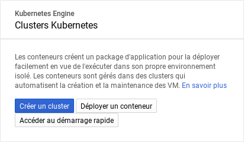

# Service mesh with Istio : tutorial

## 1) Présentation de la technologie

**Service mesh** = Network of microservices

**Istio** = Complete solution to manage a service mesh

**Core features of Istio** = Traffic management, Security, Policies, Observability

**Features Istio** = Load balancing, secure service-to-service authentication, monitoring, traffic control, policy layer, automatic metrics/logs

**Sidecar proxy** = network communication between microservices

**Platform support** = Spanning Cloud, on-premise, Kubernetes, Mesos, and more

## 2) Objectifs du tutoriel - contexte, description et résultats/connaisses  attendus après  l’exécution

Before you can install Istio, you need a cluster running a compatible version of Kubernetes. Istio 1.4 has been tested with Kubernetes releases 1.13, 1.14, 1.15.

**Google Cloud** = n1-standard-1 (4 nodes)

**Cluster Kubernetes** = 1.15.7-gke.23

**Istio** = 1.4.4

## 3) Description en détail de tous les configurations  et pas à suivre

### Configuration Google Cloud GKE (Google Kubernetes Engine)

Créer un compte Google : https://accounts.google.com/signup

Connecter vous sur le cloud de Google : https://console.cloud.google.com

Activer votre compte cloud gratuitement (300$ de crédits offert ou pendant 1 an)

Créer un nouveau projet

### Créer un nouveau cluster Kubernetes



Choisir un modèle 'Cluster standard'


Nom : istio-demo

Version maître (Kubernetes) : 1.15.7-gke.23


Nombre de nœuds : 4 (nécessaire pour tester toutes les fonctionnalités d'Istio)

Type de machine : n1-standard-1

> Il est possible d'activer Istio à la création du cluster dans l'onglet "Disponibilité, mise en réseau, sécurité et autres fonctionnalités" puis "Activer Istio (bêta)". Pour ce tutoriel nous allons installer Istio à la main pour comprendre son fonctionnement.

Appuyer sur bouton "Créer"

> Le cluster peut mettre plusieurs minutes à se créer


### Vérification de l'installation et configuration du cluster Kubernetes

Pour accéder à la console (shell) cliquer sur l'icone en haut à doite


Vérifier l'état du cluster dans la console
```
$ gcloud container clusters list
NAME        LOCATION       MASTER_VERSION  MASTER_IP     MACHINE_TYPE   NODE_VERSION   NUM_NODES  STATUS
istio-demo  us-central1-a  1.15.7-gke.23   35.238.31.56  n1-standard-1  1.15.7-gke.23  4          RUNNING
```

Obtener les informations d'identification de votre cluster afin de pouvoir interagir avec lui avec la commande `kubectl`.
Préciser la zone (LOCATION) de votre cluster, ici `us-central1-a`.
```
$ gcloud container clusters get-credentials istio-demo --zone us-central1-a
Fetching cluster endpoint and auth data.
kubeconfig entry generated for istio-demo.
```

Vérifier la version de Kubernetes
```
$ kubectl version
Client Version: version.Info{Major:"1", Minor:"15", GitVersion:"v1.15.9", GitCommit:"2e808b7cb054ee242b68e62455323aa783991f03", GitTreeState:"clean", BuildDate:"2020-01-18T23:33:14Z", GoVersion:"go1.12.12", Compiler:"gc", Platform:"linux/amd64"}
Server Version: version.Info{Major:"1", Minor:"15+", GitVersion:"v1.15.7-gke.23", GitCommit:"06e05fd0390a51ea009245a90363f9161b6f2389", GitTreeState:"clean", BuildDate:"2020-01-17T23:10:45Z", GoVersion:"go1.12.12b4", Compiler:"gc", Platform:"linux/amd64"}
```

Accordez des autorisations d'administrateur de cluster (admin) à l'utilisateur actuel. Pour créer les règles nécessaires pour Istio, l'utilisateur actuel nécessite des autorisations d'administrateur.
```
$ kubectl create clusterrolebinding cluster-admin-binding \
    --clusterrole=cluster-admin \
    --user=$(gcloud config get-value core/account)
Your active configuration is: [cloudshell-26194]
clusterrolebinding.rbac.authorization.k8s.io/cluster-admin-binding created
```

### Install Istio

```
curl -L https://istio.io/downloadIstio | sh -
```

```
cd istio-1.4.4
```

```
mv bin/istioctl /usr/local/bin
```

Enabling auto-completion
```
cp tools/istioctl.bash ~/.
```

```
source ~/istioctl.bash
```

Perform pre-check for your cluster and report whether the cluster is ready for Istio installation
```
istioctl verify-install
```

Choose the profile you want to install

<i></i>|default|demo|minimal|sds|remote
---|:---:|:---:|:---:|:---:|:---:
**Corecomponents**|   |   |   |   |   
`istio-citadel`| x | x |   | x | x 
`istio-egressgateway`|   | x |   |   |   
`istio-galley`| x | x |   | x |   
`istio-ingressgateway`| x | x |   | x |   
`istio-nodeagent`|   |   |   | x |   
`istio-pilot`| x | x | x | x |   
`istio-policy`| x | x |   | x |   
`istio-sidecar-injector`| x | x |   | x | x 
`istio-telemetry`| x | x |   | x |   
**Addons**|   |   |   |   |   
`grafana`|   | x |   |   |   
`istio-tracing`|   | x |   |   |   
`kiali`|   | x |   |   |   
`prometheus`| x | x |   | x |   

Install the built-in configuration profile demo to test all the features of Istio
```
istioctl manifest apply --set profile=demo
```

Test dashboard (Web UI)
```
istioctl dashboard
```

Choose one
```
istioctl dashboard grafana
```

## 4) Les code source et scripts élabore. 

## 5) Diapos de votre présentation en PDF.
